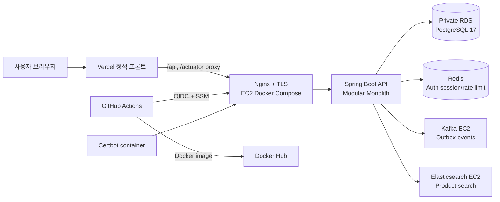
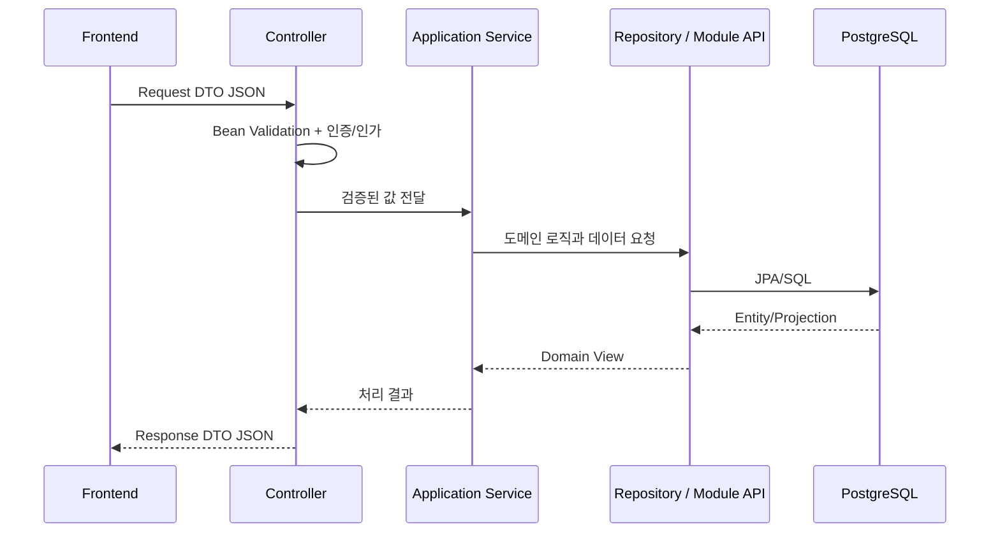

# SKALA Shop

포인트와 Fake PG 결제를 지원하는 쇼핑몰을 Java 21, Spring Boot와 Vanilla JavaScript로
구현한 모노레포입니다. 백엔드는 하나의 프로세스로 배포하지만 도메인별 경계를
분명히 둔 **모듈러 모놀리식**이며, 모듈별 공개 API와 데이터 소유권을 구분합니다.

현재 Vercel 프론트, AWS EC2 백엔드와 비공개 RDS PostgreSQL까지 운영 배포되어
있습니다.

- 운영 프론트: <https://skala-shop-bice.vercel.app>
- 운영 API health: <https://api-3-39-64-119.sslip.io/actuator/health>
- Swagger UI: <https://api-3-39-64-119.sslip.io/swagger-ui/index.html>

## 주요 기능

### 고객

- 회원가입, 로그인·로그아웃, 프로필 수정과 회원 탈퇴
- HttpOnly Access JWT, Redis Refresh Token Rotation과 CSRF 보호
- 상품명·카테고리·가격 검색, 옵션(SKU) 선택과 옵션별 재고 확인
- 저장 배송지와 기본 배송지 관리
- 장바구니와 다중 상품 주문
- 주문 내역, 결제 승인·실패, 부분 취소와 포인트·Fake PG 환급
- 배송 완료 상품의 항목별 반품 신청과 진행 상태 확인
- 회원별 1회 쿠폰, 위시리스트, 구매 인증 상품 리뷰와 재입고 알림
- 포인트 잔액과 거래 원장 조회

### 관리자

- 카테고리와 상품 등록·수정·삭제
- 상품 설명, 이미지 URL과 초기 재고 관리
- 재고 증감 조정과 변경 이력 조회
- 고객·전체 주문 조회
- 결제 이력·재처리와 반품 회수·검수·승인·환불 관리
- Elasticsearch 전체 상품 재색인
- `PAID → PREPARING → SHIPPED → DELIVERED` 배송 상태와 운송장·예상 배송일 관리

### 안정성

- 주문·취소·결제·반품·재고 명령의 UUID 멱등성과 최초 결과 재생
- 포인트 차감, 재고 예약과 주문 저장의 단일 트랜잭션
- 결제 원장, PG 거래 ID, 승인·환불 멱등성과 Fake PG 중복 웹훅 처리
- Transactional Outbox, Kafka 발행 재시도와 DEAD 상태 보존
- 주문 시점 상품명·가격·배송지 스냅샷
- 공통 Validation·예외 응답과 인증 요청 제한
- 민감정보를 기록하지 않는 API 처리 시간 AOP 로그
- Flyway 마이그레이션과 PostgreSQL 통합 테스트
- 실패 배포 자동 롤백과 known-good 릴리스 보존

## 전체 구성



브라우저는 Vercel의 같은 Origin으로 `/api`를 호출합니다. Vercel rewrite가 EC2의
HTTPS API로 전달하므로 브라우저에서 별도 API 주소나 mixed-content 문제를 만들지
않습니다. 애플리케이션 EC2에는 Backend, Redis, Nginx와 Certbot이 실행됩니다.
Kafka와 Elasticsearch는 별도 EC2에서 실행하고 애플리케이션 보안 그룹에서 들어오는
사설망 트래픽만 허용하며, DB는 외부에 공개하지 않은 RDS를 사용합니다.

## 기술 스택

| 영역 | 기술 |
| --- | --- |
| Backend | Java 21, Spring Boot 3.5.16, Spring Modulith 1.4.12 |
| Security | Spring Security, OAuth2 Resource Server, JWT, BCrypt, CSRF |
| Data | Spring Data JPA, PostgreSQL 17, Redis, Elasticsearch, Flyway |
| Messaging | Transactional Outbox, Apache Kafka |
| API | Spring MVC, Bean Validation, Springdoc OpenAPI, Swagger UI |
| Test | JUnit 5, Testcontainers, Spring Modulith Test, Playwright |
| Frontend | HTML5, CSS3, Vanilla JavaScript, Vercel |
| Infrastructure | AWS EC2 3대/RDS, Docker Compose, Nginx, Certbot, Docker Hub |
| CI/CD | GitHub Actions, GitHub OIDC, AWS Systems Manager |

## 저장소 구조

```text
.
├── src/main/java/com/skala/shopping/   # 도메인 모듈과 Spring Boot 코드
├── src/main/resources/                 # profile 설정과 Flyway V1~V26
├── src/test/                           # 단위·통합·모듈 경계 테스트
├── frontend/                           # Vercel 정적 프론트와 Playwright E2E
├── deploy/                             # EC2 Compose, Nginx, Certbot, 배포·롤백
├── docs/                               # 아키텍처, API 사용법과 테스트 전략
├── .github/workflows/                  # CI, 운영 배포, 운영 smoke
├── compose.local.yml                   # 로컬 PostgreSQL
└── Dockerfile                          # 운영 Backend 이미지
```

처음 코드를 읽는다면 다음 순서가 가장 빠릅니다.

1. [아키텍처와 모듈 경계](docs/architecture.md)
2. [API 사용 가이드](docs/api-guide.md)
3. [프론트엔드 구조와 실행](frontend/README.md)
4. [테스트 전략](docs/testing.md)
5. [EC2 운영과 배포](deploy/README.md)

DB 구조는 [도메인 ERD](docs/erd/skala-shopping-erd-overview.svg)와
[전체 테이블 ERD](docs/erd/skala-shopping-erd-full.svg)에서 바로 확인할 수 있습니다.

## 백엔드 모듈

| 모듈 | 책임 |
| --- | --- |
| `auth` | 계정, BCrypt 비밀번호, JWT 쿠키와 인증 요청 제한 |
| `member` | 고객 프로필과 저장 배송지 |
| `catalog` | 카테고리, 상품과 상품 생명주기 이벤트 |
| `inventory` | SKU별 주문 가능 재고와 재고 변경 원장 |
| `cart` | 회원별 장바구니와 상품·재고 검증 |
| `wallet` | 포인트 계정과 거래 원장 |
| `order` | 주문, 취소, 스냅샷, 배송 상태와 이력 |
| `payment` | 포인트·Fake PG 결제 준비, 승인, 환불과 결제 원장 |
| `returns` | 배송 후 항목별 반품, 회수·검수와 환불 |
| `outbox` | 도메인 이벤트 영속화, Kafka 발행·재시도 |
| `search` | Elasticsearch 상품 색인·검색과 PostgreSQL 폴백 |
| `coupon` | 쿠폰 규칙과 회원별 사용 이력 |
| `wishlist` | 회원별 관심 상품 |
| `review` | 구매 이력을 확인한 상품 리뷰 |
| `stockalert` | 품절 상품 구독과 재입고 알림 상태 |
| `storefront` | 여러 모듈을 조합하는 고객용 호환 API |
| `common` | 공통 오류와 페이지 응답 등 최소 공통 코드 |

구현 클래스, Entity, Repository와 HTTP DTO는 각 모듈의 `internal` 아래에 있습니다.
다른 모듈은 공개 인터페이스·이벤트·View만 사용합니다.

## 로컬 실행

필요한 도구:

- Java 21
- Docker와 Docker Compose plugin
- Node.js 22 이상: 프론트 빌드·E2E를 실행할 때만 필요

PostgreSQL과 백엔드를 실행합니다.

```bash
docker compose -f compose.local.yml up -d
./gradlew bootRun
```

다른 터미널에서 프론트를 실행합니다.

```bash
python3 -m http.server 3000 --directory frontend
```

| 용도 | 로컬 주소 |
| --- | --- |
| Frontend | <http://localhost:3000> |
| API | <http://localhost:8080> |
| Swagger UI | <http://localhost:8080/swagger-ui.html> |
| OpenAPI JSON | <http://localhost:8080/v3/api-docs> |
| Health | <http://localhost:8080/actuator/health> |
| PostgreSQL | `localhost:5432/skala_shop` |

로컬 기본 DB 계정은 `skala / skala`입니다. 환경변수 목록은
[`.env.example`](.env.example)에 있으며 실제 비밀번호와 JWT secret은 커밋하지
않습니다. `application.yml`의 기본 profile은 `local`, 운영 Compose는
`SPRING_PROFILES_ACTIVE=prod`를 명시합니다.

## 요청 처리 흐름



Controller는 HTTP와 DTO 변환을, Application Service는 트랜잭션과 비즈니스 규칙을,
Repository는 해당 모듈의 DB 접근을 담당합니다. JPA Entity를 HTTP 응답으로 직접
노출하지 않습니다.

## API 규칙

- 정확한 HTTP operation 수와 계약은 실행 중인 `/v3/api-docs`를 기준으로 합니다.
- Swagger UI의 도메인 그룹명, API 요약과 상세 설명은 한국어로 제공합니다.
- 상태 변경 요청은 CSRF 토큰과 `credentials: "include"`가 필요합니다.
- 주문·취소·결제·반품과 재고 초기화·조정은 `X-Idempotency-Key` UUID가 필수입니다.
- 목록의 `page`는 0부터 시작하며 `size`는 1~100입니다.
- 모든 API 오류는 `code`, `message`, `status`, `timestamp`, `fieldErrors` 형식입니다.
- 관리자 API는 `ADMIN`, 고객 주문·장바구니·포인트 API는 `CUSTOMER` 역할이 필요합니다.

상세 요청·응답 예시와 오류 코드는 [API 사용 가이드](docs/api-guide.md)와 Swagger를
참고합니다.

## 테스트

백엔드 전체 테스트:

```bash
./gradlew test
```

프론트 정적 검사와 로컬 브라우저 E2E:

```bash
node frontend/scripts/validate-static.mjs
npm --prefix frontend ci
npm --prefix frontend run test:e2e
```

현재 백엔드 126개 테스트와 데스크톱·모바일 브라우저 E2E 10개가 모듈 경계, 인증,
Validation, PostgreSQL 트랜잭션, 동시 주문·반품, 멱등 재시도와 프론트 고객·관리자
흐름을 검증합니다. 실제 Vercel·EC2·RDS를 사용하는 live E2E는 운영 데이터를
변경하므로 명시적으로 활성화할 때만 실행합니다. 자세한 구분은
[테스트 전략](docs/testing.md)에 정리했습니다.

## GitFlow와 배포

```text
feature/* → develop → main → production
```

- `feature/*`: 기능 단위 개발
- `develop`: 다음 운영 버전 통합과 전체 CI
- `main`: 운영 배포 기준
- `hotfix/*`: 운영 긴급 수정

`main` 병합 후 GitHub Actions가 테스트를 다시 실행하고 Docker Hub에 digest 기반
이미지를 게시합니다. GitHub OIDC로 AWS의 단기 권한을 얻은 뒤 SSM으로 EC2에 필요한
배포 파일만 전송합니다. Candidate health와 Nginx 검사가 모두 통과한 뒤 current로
승격하며 실패하면 known-good 릴리스로 복구합니다.

운영 환경변수, 최초 TLS, bootstrap 관리자, 초기 상품, smoke와 롤백 방법은
[배포 문서](deploy/README.md)를 참고합니다.

운영 카탈로그는 카테고리·상품 이미지·옵션 SKU·옵션별 재고를 seed로 관리합니다.
기본 카탈로그와 쇼케이스 카탈로그를 함께 적재하면 약 30개의 상품과 옵션 재고가
구성됩니다. 구매·결제 이력이 있는 시연 회원과 리뷰 데이터도 별도 도구로 생성할 수
있습니다. `Production smoke` workflow는 공개 API 확인, 카탈로그 적재, 회원가입 →
장바구니 → 카드 결제 → 배송 완료 → 반품·환불까지 운영 환경의 전체 흐름을
검증합니다.

## Kafka 사용 방식

주문 생성, 상품 생성과 재입고 이벤트는 원본 데이터 변경과 같은 PostgreSQL
트랜잭션에서 `outbox.outbox_events`에 저장됩니다. Outbox Relay는 `PENDING` 이벤트를
Kafka의 `skala-shop.domain-events` 토픽으로 발행하고 성공하면 `PUBLISHED`, 반복
실패하면 `DEAD`로 상태를 변경합니다. aggregate ID를 Kafka key로 사용해 같은
aggregate 이벤트의 partition 순서를 유지합니다.

현재 Kafka는 Outbox 이벤트의 발행·재시도·실패 보존 경로를 담당합니다. Kafka
Consumer는 아직 없으며, Elasticsearch 상품 색인은 모듈러 모놀리스 내부의
`ProductSearchChanged` 트랜잭션 이벤트가 처리합니다.

## 선택적 확장 방향

검색 기능을 독립 서비스로 분리할 때도 회원·주문·결제·재고 ERD와 기존 RDS 구조는
유지합니다.

1. 상품 변경 이벤트를 Outbox와 Kafka로 전달합니다.
2. Search Service가 Kafka Consumer로 이벤트를 받아 Elasticsearch를 갱신합니다.
3. Elasticsearch를 Search Service 전용 저장소로 사용합니다.
4. Search Service를 별도 Docker 이미지와 프로세스로 독립 배포합니다.
5. 나머지 도메인은 현재 모듈러 모놀리스에 유지합니다.

이 구성이 적용되면 전체 시스템은 모듈러 모놀리스와 독립 Search Service가 함께
동작하는 형태가 됩니다. 현재 배포에는 이 분리가 적용되어 있지 않습니다.
