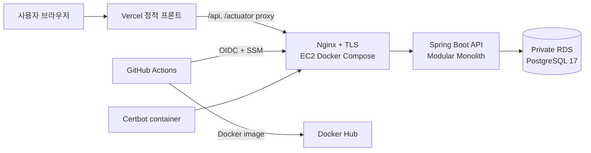
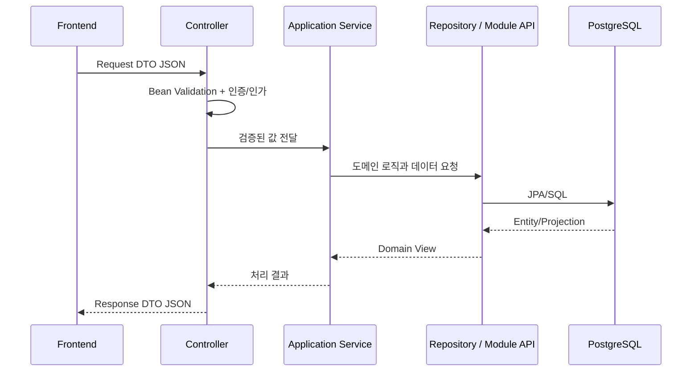

# SKALA Shop

포인트로 상품을 구매하는 쇼핑몰을 Java 21, Spring Boot와 Vanilla JavaScript로
구현한 모노레포입니다. 백엔드는 하나의 프로세스로 배포하지만 도메인별 경계를
분명히 둔 **모듈러 모놀리식**이며, 필요한 모듈을 나중에 MSA로 분리할 수 있게
공개 API와 데이터 소유권을 나눴습니다.

현재 Vercel 프론트, AWS EC2 백엔드와 비공개 RDS PostgreSQL까지 운영 배포되어
있습니다.

- 운영 프론트: <https://skala-shop-bice.vercel.app>
- 운영 API health: <https://api-3-39-64-119.sslip.io/actuator/health>
- Swagger UI: <https://api-3-39-64-119.sslip.io/swagger-ui/index.html>

## 주요 기능

### 고객

- 회원가입, 로그인·로그아웃, 프로필 수정과 회원 탈퇴
- HttpOnly JWT 쿠키 인증과 CSRF 보호
- 상품명·카테고리·가격 검색과 재고·품절 확인
- 저장 배송지와 기본 배송지 관리
- 장바구니와 다중 상품 주문
- 주문 내역, 부분 취소와 포인트 환급
- 회원별 1회 쿠폰, 위시리스트, 구매 인증 상품 리뷰와 재입고 알림
- 포인트 잔액과 거래 원장 조회

### 관리자

- 카테고리와 상품 등록·수정·삭제
- 상품 설명, 이미지 URL과 초기 재고 관리
- 재고 증감 조정과 변경 이력 조회
- 고객·전체 주문 조회
- `PAID → PREPARING → SHIPPED → DELIVERED` 배송 상태와 운송장·예상 배송일 관리

### 안정성

- 주문·취소·재고 명령의 UUID 멱등성
- 포인트 차감, 재고 예약과 주문 저장의 단일 트랜잭션
- 주문 시점 상품명·가격·배송지 스냅샷
- 공통 Validation·예외 응답과 인증 요청 제한
- 민감정보를 기록하지 않는 API 처리 시간 AOP 로그
- Flyway 마이그레이션과 PostgreSQL 통합 테스트
- 실패 배포 자동 롤백과 known-good 릴리스 보존

## 전체 구성



브라우저는 Vercel의 같은 Origin으로 `/api`를 호출합니다. Vercel rewrite가 EC2의
HTTPS API로 전달하므로 브라우저에서 별도 API 주소나 mixed-content 문제를 만들지
않습니다. EC2에는 Backend, Nginx와 Certbot만 실행하며 DB는 외부에 공개하지 않은
RDS를 사용합니다.

## 기술 스택

| 영역 | 기술 |
| --- | --- |
| Backend | Java 21, Spring Boot 3.5.16, Spring Modulith 1.4.12 |
| Security | Spring Security, OAuth2 Resource Server, JWT, BCrypt, CSRF |
| Data | Spring Data JPA, PostgreSQL 17, Flyway |
| API | Spring MVC, Bean Validation, Springdoc OpenAPI, Swagger UI |
| Test | JUnit 5, Testcontainers, Spring Modulith Test, Playwright |
| Frontend | HTML5, CSS3, Vanilla JavaScript, Vercel |
| Infrastructure | AWS EC2/RDS, Docker Compose, Nginx, Certbot, Docker Hub |
| CI/CD | GitHub Actions, GitHub OIDC, AWS Systems Manager |

## 저장소 구조

```text
.
├── src/main/java/com/skala/shopping/   # 도메인 모듈과 Spring Boot 코드
├── src/main/resources/                 # profile 설정과 Flyway V1~V20
├── src/test/                           # 단위·통합·모듈 경계 테스트
├── frontend/                           # Vercel 정적 프론트와 Playwright E2E
├── deploy/                             # EC2 Compose, Nginx, Certbot, 배포·롤백
├── docs/                               # 아키텍처, API 사용법과 테스트 전략
├── .github/workflows/                  # CI, 운영 배포, 운영 smoke
├── compose.local.yml                   # 로컬 PostgreSQL
└── Dockerfile                          # 운영 Backend 이미지
```

처음 코드를 읽는다면 다음 순서가 가장 빠릅니다.

1. [아키텍처와 모듈 경계](docs/architecture.md)
2. [API 사용 가이드](docs/api-guide.md)
3. [프론트엔드 구조와 실행](frontend/README.md)
4. [테스트 전략](docs/testing.md)
5. [EC2 운영과 배포](deploy/README.md)

## 백엔드 모듈

| 모듈 | 책임 |
| --- | --- |
| `auth` | 계정, BCrypt 비밀번호, JWT 쿠키와 인증 요청 제한 |
| `member` | 고객 프로필과 저장 배송지 |
| `catalog` | 카테고리, 상품과 상품 생명주기 이벤트 |
| `inventory` | 주문 가능 재고와 재고 변경 원장 |
| `cart` | 회원별 장바구니와 상품·재고 검증 |
| `wallet` | 포인트 계정과 거래 원장 |
| `order` | 주문, 취소, 스냅샷, 배송 상태와 이력 |
| `coupon` | 쿠폰 규칙과 회원별 사용 이력 |
| `wishlist` | 회원별 관심 상품 |
| `review` | 구매 이력을 확인한 상품 리뷰 |
| `stockalert` | 품절 상품 구독과 재입고 알림 상태 |
| `storefront` | 여러 모듈을 조합하는 고객용 호환 API |
| `common` | 공통 오류와 페이지 응답 등 최소 공통 코드 |

구현 클래스, Entity, Repository와 HTTP DTO는 각 모듈의 `internal` 아래에 있습니다.
다른 모듈은 공개 인터페이스·이벤트·View만 사용합니다.

## 로컬 실행

필요한 도구:

- Java 21
- Docker와 Docker Compose plugin
- Node.js 22 이상: 프론트 빌드·E2E를 실행할 때만 필요

PostgreSQL과 백엔드를 실행합니다.

```bash
docker compose -f compose.local.yml up -d
./gradlew bootRun
```

다른 터미널에서 프론트를 실행합니다.

```bash
python3 -m http.server 3000 --directory frontend
```

| 용도 | 로컬 주소 |
| --- | --- |
| Frontend | <http://localhost:3000> |
| API | <http://localhost:8080> |
| Swagger UI | <http://localhost:8080/swagger-ui.html> |
| OpenAPI JSON | <http://localhost:8080/v3/api-docs> |
| Health | <http://localhost:8080/actuator/health> |
| PostgreSQL | `localhost:5432/skala_shop` |

로컬 기본 DB 계정은 `skala / skala`입니다. 환경변수 목록은
[`.env.example`](.env.example)에 있으며 실제 비밀번호와 JWT secret은 커밋하지
않습니다. `application.yml`의 기본 profile은 `local`, 운영 Compose는
`SPRING_PROFILES_ACTIVE=prod`를 명시합니다.

## 요청 처리 흐름



Controller는 HTTP와 DTO 변환을, Application Service는 트랜잭션과 비즈니스 규칙을,
Repository는 해당 모듈의 DB 접근을 담당합니다. JPA Entity를 HTTP 응답으로 직접
노출하지 않습니다.

## API 규칙

- 현재 Controller 기준으로 56개 HTTP operation이 있습니다.
- 상태 변경 요청은 CSRF 토큰과 `credentials: "include"`가 필요합니다.
- 주문·취소와 재고 초기화·조정은 `X-Idempotency-Key` UUID가 필수입니다.
- 목록의 `page`는 0부터 시작하며 `size`는 1~100입니다.
- 모든 API 오류는 `code`, `message`, `status`, `timestamp`, `fieldErrors` 형식입니다.
- 관리자 API는 `ADMIN`, 고객 주문·장바구니·포인트 API는 `CUSTOMER` 역할이 필요합니다.

상세 요청·응답 예시와 오류 코드는 [API 사용 가이드](docs/api-guide.md)와 Swagger를
참고합니다.

## 테스트

백엔드 전체 테스트:

```bash
./gradlew test
```

프론트 정적 검사와 로컬 브라우저 E2E:

```bash
node frontend/scripts/validate-static.mjs
npm --prefix frontend ci
npm --prefix frontend run test:e2e
```

현재 백엔드 90개 테스트와 데스크톱·모바일 브라우저 E2E가 모듈 경계, 인증,
Validation, PostgreSQL 트랜잭션, 동시 주문, 멱등 재시도, 프론트 고객·관리자 흐름을
검증합니다. 실제 Vercel·EC2·RDS를 사용하는 live E2E는 운영 데이터를 변경하므로
명시적으로 활성화할 때만 실행합니다. 자세한 구분은 [테스트 전략](docs/testing.md)에
정리했습니다.

## GitFlow와 배포

```text
feature/* → develop → main → production
```

- `feature/*`: 기능 단위 개발
- `develop`: 다음 운영 버전 통합과 전체 CI
- `main`: 운영 배포 기준
- `hotfix/*`: 운영 긴급 수정

`main` 병합 후 GitHub Actions가 테스트를 다시 실행하고 Docker Hub에 digest 기반
이미지를 게시합니다. GitHub OIDC로 AWS의 단기 권한을 얻은 뒤 SSM으로 EC2에 필요한
배포 파일만 전송합니다. Candidate health와 Nginx 검사가 모두 통과한 뒤 current로
승격하며 실패하면 known-good 릴리스로 복구합니다.

운영 환경변수, 최초 TLS, bootstrap 관리자, 초기 상품, smoke와 롤백 방법은
[배포 문서](deploy/README.md)를 참고합니다.

## 현재 제한과 다음 확장

- 비밀번호 재설정은 교육용으로 고객 ID와 현재 이름을 확인합니다. 외부 서비스라면
  이메일·휴대전화 소유 확인과 만료되는 일회용 토큰으로 교체해야 합니다.
- 인증 요청 제한은 단일 EC2에 맞춘 인메모리 구현입니다. 다중 인스턴스와 Refresh
  Token Rotation을 도입할 때 Redis 또는 관리형 공유 저장소로 교체합니다.
- 결제는 실제 PG가 아니라 회원 포인트 원장으로 처리합니다.
- MSA 전환은 Cart/Catalog부터 시작하고, 분산 트랜잭션이 필요한 Wallet,
  Inventory와 Order는 Outbox·Saga·보상 흐름을 준비한 뒤 분리합니다.

구체적인 분리 순서와 데이터 소유권은 [아키텍처 문서](docs/architecture.md)의
`MSA 전환 순서`를 참고합니다.
