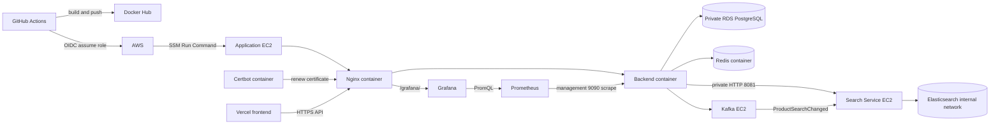

# 운영 인프라와 배포

이 문서는 SKALA Shop 백엔드를 AWS EC2에 배포하고 운영하는 방법을 설명합니다.
현재 운영 환경은 이 구성으로 배포되어 있습니다.

| 영역 | 현재 구성 |
| --- | --- |
| Frontend | Vercel, `main` production branch |
| Application | EC2, Backend·Redis·Nginx·Certbot Compose |
| Event platform | 별도 EC2, Apache Kafka KRaft single node |
| Search platform | 별도 EC2, Search Service·Elasticsearch single node |
| Database | 비공개 RDS PostgreSQL 17 |
| Monitoring | Prometheus·Grafana, Application EC2 내부 Compose |
| Edge/TLS | Nginx와 Certbot 컨테이너 |
| Image | Docker Hub digest 고정 이미지 |
| CD | GitHub OIDC + AWS Systems Manager |
| API | <https://api-3-39-64-119.sslip.io> |

무중단 배포는 목표가 아닙니다. Backend 교체 중 짧은 API 중단을 허용하는 대신,
배포 실패 시 이전 정상 image와 Nginx 구성을 함께 복구합니다.

## 공개 Docker 데모

AWS 운영 구성과 별개로, 외부 사용자가 공개 Backend 이미지를 로컬에서 확인할 수
있도록 저장소 루트에 [`compose.demo.yml`](../compose.demo.yml)을 제공합니다. Docker
Hub 로그인이나 소스 빌드 없이 다음 한 명령으로 Backend와 PostgreSQL을 시작합니다.

```bash
docker compose -f compose.demo.yml up -d --wait
```

### 요구사항과 주소

- Docker Engine과 `--wait`를 지원하는 Docker Compose v2 plugin
- 사용 가능한 `localhost:8080` 포트
- 카탈로그 seed를 선택한 경우에만 Node.js 22 이상
- 공개 Backend 이미지는 **`linux/amd64`와 `linux/arm64`를 함께 게시**하므로
  Intel·AMD64와 Apple Silicon·ARM64 환경에서 각각 네이티브로 실행할 수 있습니다.

| 용도 | 주소 |
| --- | --- |
| API | <http://localhost:8080> |
| Swagger UI | <http://localhost:8080/swagger-ui.html> |
| OpenAPI JSON | <http://localhost:8080/v3/api-docs> |
| Health | <http://localhost:8080/actuator/health> |

Backend만 `127.0.0.1:8080`에 바인딩하며 PostgreSQL 포트는 호스트에 공개하지
않습니다. `xixii/skala-shop-api:demo` 태그는 최신 데모를 가리키는 가변 별칭입니다.
운영 배포는 이 태그를 사용하지 않고 기존 배포 절차대로 commit SHA로 게시된 이미지의
digest를 고정합니다. `main` 배포 워크플로는 SHA 이미지를 게시한 뒤 Docker Hub에서
로그아웃하고 새 digest를 다시 pull해 Health와 OpenAPI를 검사합니다. 공개 접근과 실행
검증을 모두 통과한 digest만 `demo` 태그로 승격합니다.

### 초기 데이터와 선택적 관리자·seed

최초 실행 시 Flyway가 14개 스키마와 27개 테이블을 만들지만, DB에는 관리자, 회원,
카테고리, 상품, 재고와 주문 데이터가 없습니다. 관리자 기능과 예제 카탈로그가
필요하지 않다면 기본 상태 그대로 사용하면 됩니다.

관리자를 만들 때만 예제 파일을 복사하고 `.env.demo`의 관리자 bootstrap 세 값을
설정합니다. 비밀번호는 12자 이상 72 UTF-8 byte 이하여야 합니다.

```bash
cp .env.demo.example .env.demo
```

```dotenv
DEMO_BOOTSTRAP_ADMIN_ENABLED=true
DEMO_BOOTSTRAP_ADMIN_LOGIN_ID=demo-admin
DEMO_BOOTSTRAP_ADMIN_PASSWORD=replace-with-12-to-72-byte-demo-password
```

설정한 환경 파일로 Backend를 다시 만들면 관리자가 한 번 생성됩니다.

```bash
docker compose --env-file .env.demo -f compose.demo.yml \
  up -d --wait --force-recreate backend
```

생성 직후 `DEMO_BOOTSTRAP_ADMIN_ENABLED=false`로 바꾸고 ID·비밀번호 값을 지운 다음
같은 명령을 다시 실행해 bootstrap을 꺼야 합니다. 이후 기본 카탈로그가 필요할 때만
저장소 루트에서 다음 도구를 실행합니다. 예시의 비밀번호는 shell history에 직접
입력하지 말고 현재 터미널에 안전하게 주입합니다.

```bash
: "${SKALA_ADMIN_PASSWORD:?set SKALA_ADMIN_PASSWORD in the current shell first}"
SKALA_API_BASE_URL=http://localhost:8080 \
SKALA_ADMIN_ID=demo-admin \
SKALA_ADMIN_PASSWORD="$SKALA_ADMIN_PASSWORD" \
node deploy/tools/bootstrap-catalog.mjs \
  --seed=deploy/seed/catalog.example.json \
  --confirm-origin=http://localhost:8080
```

카테고리·상품·SKU가 이미 있으면 seed 도구가 건너뛰므로 같은 파일은 다시 실행할 수
있습니다. 데모 DB까지 완전히 지우려면 다음 명령을 사용합니다. 이 명령은
`demo-postgres-data` volume과 그 안의 모든 데이터를 삭제합니다.

```bash
docker compose -f compose.demo.yml down -v
```

### 데모 보안 경계

공개 이미지와 데모 Compose에는 `.env.app`, AWS 자격 증명, RDS 접속 정보, 운영 JWT
secret, Docker Hub credential, 관리자 계정이나 운영 seed가 포함되지 않습니다.
Compose 기본 DB 비밀번호와 JWT secret은 localhost 시연을 위한 알려진 값이며 운영
비밀값이 아닙니다. 다른 사람과 공유하는 PC에서는 [`.env.demo.example`](../.env.demo.example)을
기준으로 별도의 데모 전용 값을 설정하고, 운영 비밀값은 재사용하지 마세요.

이 구성은 local profile을 사용하고 Redis·Kafka·Elasticsearch·Nginx·TLS를 포함하지
않습니다. 운영 또는 인터넷 공개 용도가 아니며, 실제 AWS 배포에는 아래의 RDS,
`.env.app`, digest 고정, Nginx·Certbot과 OIDC·SSM 절차를 사용합니다.

## 1. 배포 구조



GitHub에 장기 AWS Access Key와 EC2 SSH key를 저장하지 않습니다. Actions는 GitHub
OIDC로 배포 전용 IAM Role을 맡고 SSM Run Command를 전송합니다. 저장소가
비공개이므로 EC2가 GitHub source archive를 직접 다운로드하지 않습니다. Workflow가
`compose.prod.yml`, `nginx/`, `monitoring/`, `scripts/`만 압축해 SSM 명령 안으로
전달합니다.

## 2. EC2와 RDS 준비 조건

### EC2

- Elastic IP 연결
- Docker Engine과 Docker Compose plugin
- SSM Agent online
- `flock`을 제공하는 `util-linux`
- 암호화된 EBS
- IAM instance profile에 `AmazonSSMManagedInstanceCore`
- Instance Metadata Service는 IMDSv2 token 필수

보안 그룹:

| Port | Source | 용도 |
| --- | --- | --- |
| 80 | `0.0.0.0/0` | Let's Encrypt challenge와 HTTPS redirect |
| 443 | `0.0.0.0/0` | 운영 API |
| 22 | 관리자 IP `/32`만 | 수동 관리; 자동 배포는 SSM 사용 |

Backend 8080, management 9090, Prometheus 9090, Grafana 3000과 PostgreSQL 5432는
인터넷에 직접 공개하지 않습니다. Grafana는 기존 HTTPS 443의 `/grafana/` 경로만
사용합니다. Kafka 9092는 Application EC2와 Search EC2 보안 그룹만 source로
허용합니다. Search Service 8081은 Application EC2 보안 그룹만 source로 허용하고,
Elasticsearch 9200은 Search EC2의 Docker 내부 network에만 노출합니다. 플랫폼
인스턴스의 public IP는 설치 편의를 위한 것이며 서비스 포트는 인터넷에 열지
않습니다.

### RDS

- PostgreSQL 17
- Public access 비활성화
- Storage encryption 활성화
- 자동 백업 1일 이상
- 삭제 방지 활성화
- RDS 보안 그룹 5432 source는 EC2 보안 그룹만 허용

읽기 전용 AWS audit:

```bash
AWS_REGION=ap-northeast-2 \
EC2_INSTANCE_ID=i-xxxxxxxxxxxxxxxxx \
RDS_INSTANCE_ID=skala-shop-postgres \
sh deploy/tools/audit-aws.sh
```

이 도구는 EC2 IMDSv2와 RDS의 private, encryption, deletion protection, backup,
available 상태를 검사하며 리소스를 수정하지 않습니다.

### Kafka와 Search Service EC2

플랫폼 인스턴스는 `deploy/aws/user-data-platform.sh`로 Docker와 SSM Agent를
준비하고 `/opt/skala-shop-platform`만 사용합니다. 운영 이미지는 tag가 아니라
multi-architecture manifest digest로 고정합니다.

```bash
bash deploy/scripts/deploy-platform-via-ssm.sh \
  ap-northeast-2 kafka <kafka-instance-id> <kafka-private-ip> \
  'apache/kafka@sha256:<digest>'

bash deploy/scripts/deploy-search-service-via-ssm.sh \
  ap-northeast-2 <search-instance-id> <search-private-ip> \
  '<kafka-private-ip>:9092' 'https://<api-domain>' \
  'xixii/skala-shop-api@sha256:<search-service-digest>' \
  'docker.elastic.co/elasticsearch/elasticsearch@sha256:<digest>'
```

스크립트는 Compose 파일을 SSM Run Command로 전달하고 이미지 pull, 기동과 health
확인까지 수행합니다. Kafka cluster ID와 Elasticsearch data volume은 재배포에서도
유지합니다. Elasticsearch 호스트에는 `vm.max_map_count=262144`를 영구 적용합니다.
Kafka와 Elasticsearch는 각각 single node로 구성되어 broker 또는 검색 노드 장애 시
자동 failover를 제공하지 않습니다.

Backend Outbox Relay는 `ProductSearchChanged`를 Kafka에 발행하고 Search Service가
Consumer group으로 받아 Elasticsearch를 갱신합니다. Search Service는 RDS에
접근하지 않으며, 초기 색인과 수동 재색인은 HTTPS Catalog API를 사용합니다. 검색
서비스 장애 시 Backend는 PostgreSQL 상품 검색으로 폴백합니다.

현재 운영 private endpoint:

| Service | Private endpoint | Compose |
| --- | --- | --- |
| Kafka | `172.31.36.153:9092` | `compose.kafka.yml` |
| Search Service | `http://172.31.32.50:8081` | `compose.search.yml` |
| Elasticsearch | Docker 내부 `http://elasticsearch:9200` | `compose.search.yml` |

## 3. EC2 디렉터리

```text
/opt/skala-shop/
├── deploy/
│   ├── .env.infra            # 모든 릴리스가 공유하는 공개 인프라 설정
│   ├── .env.app              # Backend 비밀 환경변수
│   ├── grafana-admin-password # 최초 배포가 생성하는 mode 600 관리자 비밀번호
│   └── grafana-secret-key     # Grafana 암호화용 mode 600 secret
├── releases/
│   └── <release-id>/
│       ├── compose.prod.yml
│       ├── monitoring/
│       ├── nginx/
│       └── scripts/
└── state/
    ├── current.env           # 현재 실행 릴리스
    ├── known-good.env        # 직전 정상 릴리스
    ├── candidate.env         # 배포 진행 중 표식
    ├── deploy-*.env          # 중단 복구 journal
    ├── rollback-*.env        # rollback journal
    ├── failed.env            # 최근 실패 릴리스
    └── deploy.lock           # flock 대상
```

최초 한 번 디렉터리와 공유 설정을 준비합니다.

```bash
sudo install -d -m 755 /opt/skala-shop/deploy /opt/skala-shop/releases /opt/skala-shop/state
sudo chown -R "$USER":"$USER" /opt/skala-shop
cp deploy/.env.infra.example /opt/skala-shop/deploy/.env.infra
cp deploy/.env.app.example /opt/skala-shop/deploy/.env.app
chmod 600 /opt/skala-shop/deploy/.env.infra /opt/skala-shop/deploy/.env.app
```

## 4. 환경변수

### `.env.infra`

```dotenv
API_DOMAIN=api.example.com
FRONTEND_ORIGIN=https://example.vercel.app
LETSENCRYPT_EMAIL=admin@example.com
APP_ENV_FILE=/opt/skala-shop/deploy/.env.app
```

- `API_DOMAIN`: scheme과 path가 없는 API DNS name
- `FRONTEND_ORIGIN`: trailing slash가 없는 정확한 Vercel HTTPS Origin 하나
- `LETSENCRYPT_EMAIL`: 인증서 만료 알림을 받을 실제 이메일
- `APP_ENV_FILE`: 반드시 `/opt/skala-shop/deploy/.env.app`

### `.env.app`

아래는 핵심 항목만 보여주는 예시입니다. 인증 요청 제한을 포함한 전체 목록과
기본값은 [`.env.app.example`](.env.app.example)을 기준으로 작성합니다.

```dotenv
DB_URL=jdbc:postgresql://<rds-endpoint>:5432/skala_shop?sslmode=require
DB_USERNAME=skala_app
DB_PASSWORD=<application-user-password>
JWT_SECRET=<at-least-32-byte-random-secret>
JWT_ISSUER=skala-shop-api
JWT_ACCESS_TOKEN_TTL=1h
JWT_REFRESH_TOKEN_TTL=14d
JWT_COOKIE_SECURE=true
JWT_COOKIE_SAME_SITE=Lax
CORS_ALLOWED_ORIGINS=https://example.vercel.app
INITIAL_MEMBER_POINTS=1000000
API_LOGGING_ENABLED=true
AUTH_RATE_LIMIT_ENABLED=true
AUTH_RATE_LIMIT_STORE=redis
REDIS_HOST=redis
REDIS_PORT=6379
OUTBOX_RELAY_ENABLED=true
OUTBOX_PUBLISHER=kafka
KAFKA_BOOTSTRAP_SERVERS=<kafka-private-ip>:9092
SEARCH_ENABLED=true
SEARCH_SERVICE_URL=http://<search-private-ip>:8081
BOOTSTRAP_ADMIN_ENABLED=false
BOOTSTRAP_ADMIN_LOGIN_ID=
BOOTSTRAP_ADMIN_PASSWORD=
```

실제 비밀값 파일은 Git에 올리지 않습니다. 일반 배포는 다음을 자동 검사합니다.

- PostgreSQL JDBC URL과 필수 DB 계정
- 32자 이상 JWT secret
- `JWT_COOKIE_SECURE=true`
- `CORS_ALLOWED_ORIGINS`에 정확한 `FRONTEND_ORIGIN` 포함
- `BOOTSTRAP_ADMIN_ENABLED=false`
- 예시 placeholder가 남아 있지 않음

## 5. 최초 관리자

최초 관리자 생성 때만 다음 값을 설정하고 Backend를 한 번 기동합니다.

```dotenv
BOOTSTRAP_ADMIN_ENABLED=true
BOOTSTRAP_ADMIN_LOGIN_ID=<admin-id>
BOOTSTRAP_ADMIN_PASSWORD=<12-to-72-byte-password>
```

일반 자동 배포는 bootstrap 활성 상태를 거부합니다. 최초 수동 실행에서만 process
environment에 `ALLOW_BOOTSTRAP_ADMIN_ONCE=true`를 지정할 수 있습니다.

관리자가 생성되면 즉시 다음 상태로 되돌립니다.

```dotenv
BOOTSTRAP_ADMIN_ENABLED=false
BOOTSTRAP_ADMIN_LOGIN_ID=
BOOTSTRAP_ADMIN_PASSWORD=
```

관리자 비밀번호는 이후 `PUT /api/admin/password`로 변경합니다.

## 6. 운영 초기 상품

[`seed/catalog.example.json`](seed/catalog.example.json)을 복사해 카테고리·상품·
옵션 SKU·옵션별 초기 재고를 작성합니다. 도구는 카테고리명·상품명·SKU가 이미
존재하면 건너뛰므로 반복 실행할 수 있습니다.

관리자 비밀번호는 파일이나 shell history에 평문으로 남기지 말고 안전한 방식으로
환경변수에 주입합니다.

```bash
SKALA_API_BASE_URL=https://api.example.com \
SKALA_ADMIN_ID=<admin-id> \
SKALA_ADMIN_PASSWORD=<securely-injected-password> \
node deploy/tools/bootstrap-catalog.mjs \
  --seed=deploy/seed/catalog.example.json \
  --confirm-origin=https://api.example.com
```

쇼케이스 카탈로그는 `deploy/seed/catalog.showcase.json`에 분리되어 있습니다. 기본 seed와
함께 적재하면 기존 운영 상품을 포함해 약 30개의 상품을 구성할 수 있습니다. 구매 인증
리뷰 시연 데이터는 비밀번호를 저장하거나 출력하지 않는 다음 명령으로 한 번만 생성합니다.

```bash
SKALA_API_BASE_URL=https://api.example.com \
node deploy/tools/seed-demo-reviews.mjs \
  --confirm-origin=https://api.example.com
```

이 명령은 무작위 자격 증명을 사용하는 시연 회원 6명과 결제 완료 주문, 리뷰 12개를
운영 데이터로 남깁니다. 반복 실행하면 회원과 리뷰가 추가되므로 초기 구성 시 한 번만
실행합니다. 운영 인증 요청 제한을 지키기 위해 계정 생성 사이에 기본 13초 간격을
둡니다. 중간에 중단됐다면 `--start-index=<완료한 회원 수>`와 `--count=<남은 회원 수>`로
남은 범위만 재개할 수 있습니다.

`--confirm-origin`은 실수로 다른 서버의 데이터를 변경하지 않도록 API Origin과
정확히 같아야 합니다. 작업 후 도구가 관리자 세션을 로그아웃합니다.

결제부터 배송과 반품 환불까지 운영 전체 흐름을 점검하려면 다음 도구를 사용합니다.
검증용 고객은 완료 여부와 관계없이 마지막에 비활성화됩니다.

```bash
SKALA_API_BASE_URL=https://api.example.com \
SKALA_ADMIN_ID=<admin-id> \
SKALA_ADMIN_PASSWORD=<securely-injected-password> \
node deploy/tools/verify-commerce-flow.mjs \
  --confirm-origin=https://api.example.com
```

## 7. TLS와 container

운영 Compose에는 다음 service가 있습니다.

| Service | 역할 |
| --- | --- |
| `backend` | Spring Boot API 8080, Actuator management 9090 |
| `redis` | Refresh Session과 인증 요청 제한 공유 저장소 |
| `prometheus` | 내부 management 메트릭 수집·단기 보존 |
| `grafana` | Prometheus datasource와 Backend dashboard |
| `nginx` | 80/443, TLS 종료, proxy와 IP rate limit |
| `certbot-renew` | 12시간마다 인증서 갱신 확인 |
| `nginx-bootstrap` | 최초 HTTP 인증서 발급 전용 profile |
| `certbot` | 인증서 발급 도구 profile |

Nginx는 6시간마다 인증서를 다시 읽도록 reload합니다. Certbot에 Docker socket을
마운트하지 않습니다.

최초 TLS는 GitHub Actions의 `Deploy production`을 수동 실행하고
`bootstrap_tls=true`를 선택하는 방식이 가장 간단합니다. 이후 배포는 기본값
`false`를 사용합니다.

수동으로 실행한다면 같은 릴리스 디렉터리의 script와 immutable image digest를
사용합니다.

```bash
/opt/skala-shop/releases/<release-id>/scripts/bootstrap-tls.sh \
  <release-id> \
  '<dockerhub-user>/skala-shop-api@sha256:<64-hex-digest>'
```

## 8. Prometheus와 Grafana

Prometheus는 30초마다 Backend의 내부
`http://backend:9090/actuator/prometheus`를 수집하고 Grafana가 이를 dashboard로
보여줍니다. Prometheus와 Grafana는 host port가 없으며 Grafana만 다음 HTTPS 경로로
접근합니다.

Dashboard는 HTTP 요청 수·상태·지연 시간, JVM heap·CPU, HikariCP connection과 함께
비즈니스 오류, 결제 승인·실패, 환불·재처리와 Fake PG webhook counter를 보여줍니다.
모든 meter에는 `application=skala-shop-api` 공통 label을 사용합니다.

```text
https://<API_DOMAIN>/grafana/
```

Grafana의 anonymous access와 사용자 가입은 꺼져 있습니다. 최초 관리자 ID는
`admin`이고, 배포 script가 다음 파일을 mode 600으로 한 번 생성해 Compose secret으로
전달합니다.

```text
/opt/skala-shop/deploy/grafana-admin-password
/opt/skala-shop/deploy/grafana-secret-key
```

두 값은 Git, GitHub secret이나 보고서에 복사하지 않습니다. EC2의 `ubuntu` 사용자로
접속한 상태에서 최초 로그인할 때만 관리자 비밀번호 파일을 확인하고, 로그인 후에는
Grafana 화면에서 별도 비밀번호로 변경합니다. `grafana-secret-key`는 session과
datasource secret 암호화에 계속 사용하므로 삭제하거나 임의 교체하지 않습니다. 기존
`grafana-data` volume이 있는 상태에서 관리자 비밀번호 파일만 바꿔도 이미 생성된
관리자 비밀번호는 바뀌지 않습니다.

Application EC2는 약 2GiB RAM, swap 0인 소형 인스턴스입니다. 추가 container가
Backend를 압박하지 않도록 Prometheus와 Grafana 각각에 다음 제한을 둡니다.

| 항목 | Prometheus | Grafana |
| --- | --- | --- |
| memory limit | 192MiB | 256MiB |
| memory reservation | 64MiB | 96MiB |
| CPU limit | 0.50 | 0.50 |
| 저장 정책 | 3일 또는 512MB | dashboard·사용자 DB volume |

Prometheus는 기간과 용량 중 먼저 도달한 조건에 따라 오래된 데이터를 정리합니다.
이 제한은 메모리 부족 가능성을 낮추지만 없애지는 않습니다. 배포 직후와 부하 테스트
후에는 `free -m`, `docker stats --no-stream`, kernel OOM 기록을 확인하고 여유가
부족하면 보존 기간을 더 줄이거나 인스턴스 크기를 올립니다.

보안 경계는 다음과 같습니다.

- 공개 `/actuator/health`만 Nginx가 Backend management 9090으로 정확히 전달합니다.
- `/actuator/prometheus`와 나머지 Actuator 경로는 Nginx에서 404로 차단합니다.
- Prometheus와 Grafana의 9090·3000은 EC2 security group과 host port에 열지 않습니다.
- Grafana 화면은 Nginx TLS와 로그인 뒤에서만 제공하고 provisioning dashboard의 UI
  임의 변경은 비활성화합니다.

배포 script는 Prometheus `/-/healthy`, Grafana `/api/health`와 Prometheus query의
`up{job="skala-shop-api"}=1`을 확인합니다. 하나라도 실패하면 해당 candidate를
승격하지 않고 이전 known-good 릴리스로 복구합니다. 공개 경계는 다음 명령으로 다시
확인할 수 있습니다.

```bash
curl --fail --silent https://api.example.com/grafana/api/health
test "$(curl --silent --output /dev/null --write-out '%{http_code}' \
  https://api.example.com/actuator/prometheus)" = 404
```

현재 구성은 한 EC2와 local Docker volume을 사용하는 단일 node입니다. Prometheus와
Grafana 자체의 고가용성, 장기 보관, Alertmanager 알림은 포함하지 않습니다. EC2·RDS
리소스 alarm은 기존 CloudWatch가 담당하고 애플리케이션 요청 상태는 Grafana에서
확인합니다.

## 9. GitHub 설정

### Secrets

```text
DOCKERHUB_USERNAME
DOCKERHUB_PUSH_TOKEN
```

Docker Hub push token에는 read/write만 부여합니다. EC2는 별도의 read-only token으로
한 번 `docker login`하고 해당 credential을 `ubuntu` 사용자 아래에 보관합니다.

### Variables

```text
DOCKERHUB_IMAGE=<dockerhub-user>/skala-shop-api
AWS_DEPLOY_ROLE_ARN=arn:aws:iam::<account-id>:role/SKALAShopGitHubDeployRole
AWS_REGION=ap-northeast-2
EC2_INSTANCE_ID=i-xxxxxxxxxxxxxxxxx
KAFKA_INSTANCE_ID=i-xxxxxxxxxxxxxxxxx
KAFKA_PRIVATE_IP=10.x.x.x
SEARCH_INSTANCE_ID=i-xxxxxxxxxxxxxxxxx
SEARCH_PRIVATE_IP=10.x.x.x
PRODUCTION_DEPLOY_ENABLED=true
PRODUCTION_FRONTEND_ORIGIN=https://example.vercel.app
PRODUCTION_API_ORIGIN=https://api.example.com
```

`PRODUCTION_DEPLOY_ENABLED=false`이면 `main`에서도 테스트만 실행하고 image 게시와
EC2 배포를 건너뜁니다. Docker Hub, EC2, RDS, DNS와 최초 인증서를 확인한 뒤에만
`true`로 바꿉니다.

선택적인 production environment secrets:

```text
PRODUCTION_ADMIN_ID
PRODUCTION_ADMIN_PASSWORD
```

이 값은 운영 카탈로그 적재, 관리자 화면 확인과 결제·배송·반품 전체 흐름 검증에
사용합니다. 일반 애플리케이션 배포에는 사용하지 않습니다.

## 10. CI/CD 흐름

```text
feature push / PR
→ Backend tests
→ Frontend static checks + desktop/mobile E2E
→ Monitoring config validation
→ Release flow simulation
→ develop merge
→ main PR에서 전체 재검증
→ main merge
→ Docker Hub immutable digest image
→ GitHub OIDC
→ SSM으로 릴리스 파일 전달
→ Candidate Backend health
→ Prometheus·Grafana health와 Backend scrape target UP
→ Candidate Nginx config test
→ live edge 전환과 nginx -t
→ current 승격
```

`main` workflow는 production concurrency의 `cancel-in-progress: false`를 사용합니다.
배포가 겹치면 취소하지 않고 순서대로 실행하며 EC2의 `flock`도 자동 배포, 수동
배포, rollback과 TLS bootstrap을 직렬화합니다.

## 11. 배포 상태와 rollback

현재 container 확인:

```bash
CURRENT_METADATA=/opt/skala-shop/state/current.env
CURRENT_COMPOSE=$(sed -n 's/^RELEASE_COMPOSE_FILE=//p' "$CURRENT_METADATA")
docker compose \
  --project-name skala-shop \
  --env-file /opt/skala-shop/deploy/.env.infra \
  --env-file "$CURRENT_METADATA" \
  -f "$CURRENT_COMPOSE" ps
```

수동 배포:

```bash
/opt/skala-shop/releases/<release-id>/scripts/deploy.sh \
  <release-id> \
  '<dockerhub-user>/skala-shop-api@sha256:<64-hex-digest>'
```

수동 rollback:

```bash
CURRENT_RELEASE_DIR=$(sed -n 's/^RELEASE_DIR=//p' /opt/skala-shop/state/current.env)
"$CURRENT_RELEASE_DIR/scripts/rollback.sh"
```

Candidate pull, Backend·Prometheus·Grafana health, Prometheus scrape, Nginx 검사
또는 edge 전환이 실패하면 Backend image와 Compose/Nginx/monitoring 구성을 같은
이전 릴리스로 복구합니다. 첫 배포에는 이전 릴리스가 없어 자동 복구 대상도 없습니다.

`current.env`, `known-good.env`, `failed.env`가 가리키는 릴리스 디렉터리는 삭제하지
않습니다. Flyway 변경은 image rollback으로 되돌아가지 않으므로 DB는
expand/contract와 forward-fix를 사용합니다.

로컬에서 상태 전환을 검증합니다.

```bash
sh deploy/tests/monitoring-config-test.sh
sh deploy/tests/release-flow-test.sh
```

## 12. 운영 확인

읽기 전용 public smoke:

```bash
SKALA_FRONTEND_ORIGIN=https://example.vercel.app \
SKALA_API_BASE_URL=https://api.example.com \
node deploy/tools/smoke-production.mjs
```

확인 대상:

- Vercel HTML
- `/actuator/health`의 `UP`
- `/grafana/api/health`의 database `ok`
- 공개 `/actuator/prometheus`의 404
- 카테고리와 상품 공개 API
- OpenAPI JSON

GitHub의 `Production smoke` workflow도 동일한 검사를 수동 실행합니다.
`run_mutating_e2e=true`를 선택할 때만 임시 고객을 만들어 가입·주문·취소·탈퇴를
검사합니다.

Kafka Compose를 변경하거나 인스턴스를 복구한 경우 `Deploy platform` workflow를
실행합니다. Search Service만 다시 배포할 때는 `Deploy search service` workflow가
테스트, 다중 아키텍처 이미지 게시와 Search EC2 배포를 독립적으로 수행합니다.

## 13. Proxy, CORS와 요청 제한

Vercel 기본 구성은 같은 Origin `/api` proxy를 사용합니다. API를 직접 다른
Origin에서 호출한다면 Spring의 `CORS_ALLOWED_ORIGINS`와 Nginx의
`FRONTEND_ORIGIN`을 정확히 맞춰야 합니다.

Nginx와 애플리케이션은 로그인·회원가입·비밀번호 재설정에 요청 제한을
적용합니다. local profile은 인메모리, prod profile은 같은 Compose의 Redis에 IP·계정
카운터를 저장합니다. ALB/CDN을 앞에 추가하면 trusted proxy와 real IP 설정을 먼저
구성해야 올바른 client IP 기준으로 제한할 수 있습니다.

## 14. 운영 체크리스트

현재 CloudWatch에는 Application/Kafka/Search EC2 각각의 status check 실패와 10분
고CPU 알람, RDS의 10분 고CPU와 여유 저장공간 2GiB 미만 알람이 구성되어 있습니다.
알람은 AWS 상태를 기록하지만 SNS action은 아직 없으므로 운영 연락용 이메일 또는
메신저 endpoint를 정한 뒤 SNS topic을 연결해야 실제 통지를 받을 수 있습니다.

배포 전:

- [ ] PR CI와 Vercel Preview 성공
- [ ] `.env.app`에 placeholder와 bootstrap 자격 증명 없음
- [ ] RDS backup과 deletion protection 확인
- [ ] Flyway 변경이 backward compatible함
- [ ] `PRODUCTION_DEPLOY_ENABLED` 의도 확인

배포 후:

- [ ] GitHub `Deploy production` 성공
- [ ] Vercel production 반영
- [ ] public smoke 성공
- [ ] Swagger와 health 응답 확인
- [ ] Grafana 로그인과 Backend dashboard 데이터 확인
- [ ] Prometheus target `UP`, 외부 `/actuator/prometheus` 404 확인
- [ ] `free -m`, `docker stats --no-stream`와 OOM 기록 확인
- [ ] 오류율·디스크·Docker log 확인

장애 시:

- [ ] `failed.env`, current/known-good와 Actions SSM 출력 확인
- [ ] 필요하면 수동 rollback
- [ ] DB migration 문제는 image rollback이 아니라 forward-fix 판단
