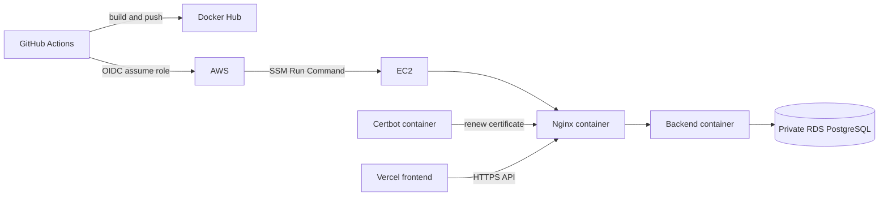

# 운영 인프라와 배포

이 문서는 SKALA Shop 백엔드를 AWS EC2에 배포하고 운영하는 방법을 설명합니다.
현재 운영 환경은 이 구성으로 배포되어 있습니다.

| 영역 | 현재 구성 |
| --- | --- |
| Frontend | Vercel, `main` production branch |
| Backend | 단일 EC2, Docker Compose |
| Database | 비공개 RDS PostgreSQL 17 |
| Edge/TLS | Nginx와 Certbot 컨테이너 |
| Image | Docker Hub digest 고정 이미지 |
| CD | GitHub OIDC + AWS Systems Manager |
| API | <https://api-3-39-64-119.sslip.io> |

무중단 배포는 목표가 아닙니다. Backend 교체 중 짧은 API 중단을 허용하는 대신,
배포 실패 시 이전 정상 image와 Nginx 구성을 함께 복구합니다.

## 1. 배포 구조



GitHub에 장기 AWS Access Key와 EC2 SSH key를 저장하지 않습니다. Actions는 GitHub
OIDC로 배포 전용 IAM Role을 맡고 SSM Run Command를 전송합니다. 저장소가
비공개이므로 EC2가 GitHub source archive를 직접 다운로드하지 않습니다. Workflow가
`compose.prod.yml`, `nginx/`, `scripts/`만 압축해 SSM 명령 안으로 전달합니다.

## 2. EC2와 RDS 준비 조건

### EC2

- Elastic IP 연결
- Docker Engine과 Docker Compose plugin
- SSM Agent online
- `flock`을 제공하는 `util-linux`
- 암호화된 EBS
- IAM instance profile에 `AmazonSSMManagedInstanceCore`
- Instance Metadata Service는 IMDSv2 token 필수

보안 그룹:

| Port | Source | 용도 |
| --- | --- | --- |
| 80 | `0.0.0.0/0` | Let's Encrypt challenge와 HTTPS redirect |
| 443 | `0.0.0.0/0` | 운영 API |
| 22 | 관리자 IP `/32`만 | 수동 관리; 자동 배포는 SSM 사용 |

Backend 8080과 PostgreSQL 5432는 인터넷에 공개하지 않습니다.

### RDS

- PostgreSQL 17
- Public access 비활성화
- Storage encryption 활성화
- 자동 백업 1일 이상
- 삭제 방지 활성화
- RDS 보안 그룹 5432 source는 EC2 보안 그룹만 허용

읽기 전용 AWS audit:

```bash
AWS_REGION=ap-northeast-2 \
EC2_INSTANCE_ID=i-xxxxxxxxxxxxxxxxx \
RDS_INSTANCE_ID=skala-shop-postgres \
sh deploy/tools/audit-aws.sh
```

이 도구는 EC2 IMDSv2와 RDS의 private, encryption, deletion protection, backup,
available 상태를 검사하며 리소스를 수정하지 않습니다.

## 3. EC2 디렉터리

```text
/opt/skala-shop/
├── deploy/
│   ├── .env.infra            # 모든 릴리스가 공유하는 공개 인프라 설정
│   └── .env.app              # Backend 비밀 환경변수
├── releases/
│   └── <release-id>/
│       ├── compose.prod.yml
│       ├── nginx/
│       └── scripts/
└── state/
    ├── current.env           # 현재 실행 릴리스
    ├── known-good.env        # 직전 정상 릴리스
    ├── candidate.env         # 배포 진행 중 표식
    ├── deploy-*.env          # 중단 복구 journal
    ├── rollback-*.env        # rollback journal
    ├── failed.env            # 최근 실패 릴리스
    └── deploy.lock           # flock 대상
```

최초 한 번 디렉터리와 공유 설정을 준비합니다.

```bash
sudo install -d -m 755 /opt/skala-shop/deploy /opt/skala-shop/releases /opt/skala-shop/state
sudo chown -R "$USER":"$USER" /opt/skala-shop
cp deploy/.env.infra.example /opt/skala-shop/deploy/.env.infra
cp deploy/.env.app.example /opt/skala-shop/deploy/.env.app
chmod 600 /opt/skala-shop/deploy/.env.infra /opt/skala-shop/deploy/.env.app
```

## 4. 환경변수

### `.env.infra`

```dotenv
API_DOMAIN=api.example.com
FRONTEND_ORIGIN=https://example.vercel.app
LETSENCRYPT_EMAIL=admin@example.com
APP_ENV_FILE=/opt/skala-shop/deploy/.env.app
```

- `API_DOMAIN`: scheme과 path가 없는 API DNS name
- `FRONTEND_ORIGIN`: trailing slash가 없는 정확한 Vercel HTTPS Origin 하나
- `LETSENCRYPT_EMAIL`: 인증서 만료 알림을 받을 실제 이메일
- `APP_ENV_FILE`: 반드시 `/opt/skala-shop/deploy/.env.app`

### `.env.app`

아래는 핵심 항목만 보여주는 예시입니다. 인증 요청 제한을 포함한 전체 목록과
기본값은 [`.env.app.example`](.env.app.example)을 기준으로 작성합니다.

```dotenv
DB_URL=jdbc:postgresql://<rds-endpoint>:5432/skala_shop?sslmode=require
DB_USERNAME=skala_app
DB_PASSWORD=<application-user-password>
JWT_SECRET=<at-least-32-byte-random-secret>
JWT_ISSUER=skala-shop-api
JWT_ACCESS_TOKEN_TTL=1h
JWT_COOKIE_SECURE=true
JWT_COOKIE_SAME_SITE=Lax
CORS_ALLOWED_ORIGINS=https://example.vercel.app
INITIAL_MEMBER_POINTS=1000000
API_LOGGING_ENABLED=true
AUTH_RATE_LIMIT_ENABLED=true
BOOTSTRAP_ADMIN_ENABLED=false
BOOTSTRAP_ADMIN_LOGIN_ID=
BOOTSTRAP_ADMIN_PASSWORD=
```

실제 비밀값 파일은 Git에 올리지 않습니다. 일반 배포는 다음을 자동 검사합니다.

- PostgreSQL JDBC URL과 필수 DB 계정
- 32자 이상 JWT secret
- `JWT_COOKIE_SECURE=true`
- `CORS_ALLOWED_ORIGINS`에 정확한 `FRONTEND_ORIGIN` 포함
- `BOOTSTRAP_ADMIN_ENABLED=false`
- 예시 placeholder가 남아 있지 않음

## 5. 최초 관리자

최초 관리자 생성 때만 다음 값을 설정하고 Backend를 한 번 기동합니다.

```dotenv
BOOTSTRAP_ADMIN_ENABLED=true
BOOTSTRAP_ADMIN_LOGIN_ID=<admin-id>
BOOTSTRAP_ADMIN_PASSWORD=<12-to-72-byte-password>
```

일반 자동 배포는 bootstrap 활성 상태를 거부합니다. 최초 수동 실행에서만 process
environment에 `ALLOW_BOOTSTRAP_ADMIN_ONCE=true`를 지정할 수 있습니다.

관리자가 생성되면 즉시 다음 상태로 되돌립니다.

```dotenv
BOOTSTRAP_ADMIN_ENABLED=false
BOOTSTRAP_ADMIN_LOGIN_ID=
BOOTSTRAP_ADMIN_PASSWORD=
```

관리자 비밀번호는 이후 `PUT /api/admin/password`로 변경합니다.

## 6. 운영 초기 상품

[`seed/catalog.example.json`](seed/catalog.example.json)을 복사해 카테고리·상품·
초기 재고를 작성합니다. 도구는 이름이 이미 존재하는 항목을 건너뛰므로 반복
실행할 수 있습니다.

관리자 비밀번호는 파일이나 shell history에 평문으로 남기지 말고 안전한 방식으로
환경변수에 주입합니다.

```bash
SKALA_API_BASE_URL=https://api.example.com \
SKALA_ADMIN_ID=<admin-id> \
SKALA_ADMIN_PASSWORD=<securely-injected-password> \
node deploy/tools/bootstrap-catalog.mjs \
  --seed=deploy/seed/catalog.example.json \
  --confirm-origin=https://api.example.com
```

`--confirm-origin`은 실수로 다른 서버의 데이터를 변경하지 않도록 API Origin과
정확히 같아야 합니다. 작업 후 도구가 관리자 세션을 로그아웃합니다.

## 7. TLS와 container

운영 Compose에는 다음 service가 있습니다.

| Service | 역할 |
| --- | --- |
| `backend` | Spring Boot API, 내부 8080 |
| `nginx` | 80/443, TLS 종료, proxy와 IP rate limit |
| `certbot-renew` | 12시간마다 인증서 갱신 확인 |
| `nginx-bootstrap` | 최초 HTTP 인증서 발급 전용 profile |
| `certbot` | 인증서 발급 도구 profile |

Nginx는 6시간마다 인증서를 다시 읽도록 reload합니다. Certbot에 Docker socket을
마운트하지 않습니다.

최초 TLS는 GitHub Actions의 `Deploy production`을 수동 실행하고
`bootstrap_tls=true`를 선택하는 방식이 가장 간단합니다. 이후 배포는 기본값
`false`를 사용합니다.

수동으로 실행한다면 같은 릴리스 디렉터리의 script와 immutable image digest를
사용합니다.

```bash
/opt/skala-shop/releases/<release-id>/scripts/bootstrap-tls.sh \
  <release-id> \
  '<dockerhub-user>/skala-shop-api@sha256:<64-hex-digest>'
```

## 8. GitHub 설정

### Secrets

```text
DOCKERHUB_USERNAME
DOCKERHUB_PUSH_TOKEN
```

Docker Hub push token에는 read/write만 부여합니다. EC2는 별도의 read-only token으로
한 번 `docker login`하고 해당 credential을 `ubuntu` 사용자 아래에 보관합니다.

### Variables

```text
DOCKERHUB_IMAGE=<dockerhub-user>/skala-shop-api
AWS_DEPLOY_ROLE_ARN=arn:aws:iam::<account-id>:role/SKALAShopGitHubDeployRole
AWS_REGION=ap-northeast-2
EC2_INSTANCE_ID=i-xxxxxxxxxxxxxxxxx
PRODUCTION_DEPLOY_ENABLED=true
PRODUCTION_FRONTEND_ORIGIN=https://example.vercel.app
PRODUCTION_API_ORIGIN=https://api.example.com
```

`PRODUCTION_DEPLOY_ENABLED=false`이면 `main`에서도 테스트만 실행하고 image 게시와
EC2 배포를 건너뜁니다. Docker Hub, EC2, RDS, DNS와 최초 인증서를 확인한 뒤에만
`true`로 바꿉니다.

선택적인 production environment secrets:

```text
PRODUCTION_ADMIN_ID
PRODUCTION_ADMIN_PASSWORD
```

이 값은 수동 live E2E의 관리자 읽기 검사에만 사용합니다. 설정하지 않아도 고객
live E2E와 일반 배포에는 영향이 없습니다.

## 9. CI/CD 흐름

```text
feature push / PR
→ Backend 82 tests
→ Frontend static checks + desktop/mobile E2E
→ Release flow simulation
→ develop merge
→ main PR에서 전체 재검증
→ main merge
→ Docker Hub immutable digest image
→ GitHub OIDC
→ SSM으로 릴리스 파일 전달
→ Candidate Backend health
→ Candidate Nginx config test
→ live edge 전환과 nginx -t
→ current 승격
```

`main` workflow는 production concurrency의 `cancel-in-progress: false`를 사용합니다.
배포가 겹치면 취소하지 않고 순서대로 실행하며 EC2의 `flock`도 자동 배포, 수동
배포, rollback과 TLS bootstrap을 직렬화합니다.

## 10. 배포 상태와 rollback

현재 container 확인:

```bash
CURRENT_METADATA=/opt/skala-shop/state/current.env
CURRENT_COMPOSE=$(sed -n 's/^RELEASE_COMPOSE_FILE=//p' "$CURRENT_METADATA")
docker compose \
  --project-name skala-shop \
  --env-file /opt/skala-shop/deploy/.env.infra \
  --env-file "$CURRENT_METADATA" \
  -f "$CURRENT_COMPOSE" ps
```

수동 배포:

```bash
/opt/skala-shop/releases/<release-id>/scripts/deploy.sh \
  <release-id> \
  '<dockerhub-user>/skala-shop-api@sha256:<64-hex-digest>'
```

수동 rollback:

```bash
CURRENT_RELEASE_DIR=$(sed -n 's/^RELEASE_DIR=//p' /opt/skala-shop/state/current.env)
"$CURRENT_RELEASE_DIR/scripts/rollback.sh"
```

Candidate pull, Backend health, Nginx 검사 또는 edge 전환이 실패하면 Backend image와
Compose/Nginx 구성을 같은 이전 릴리스로 복구합니다. 첫 배포에는 이전 릴리스가
없어 자동 복구 대상도 없습니다.

`current.env`, `known-good.env`, `failed.env`가 가리키는 릴리스 디렉터리는 삭제하지
않습니다. Flyway 변경은 image rollback으로 되돌아가지 않으므로 DB는
expand/contract와 forward-fix를 사용합니다.

로컬에서 상태 전환을 검증합니다.

```bash
sh deploy/tests/release-flow-test.sh
```

## 11. 운영 확인

읽기 전용 public smoke:

```bash
SKALA_FRONTEND_ORIGIN=https://example.vercel.app \
SKALA_API_BASE_URL=https://api.example.com \
node deploy/tools/smoke-production.mjs
```

확인 대상:

- Vercel HTML
- `/actuator/health`의 `UP`
- 카테고리와 상품 공개 API
- OpenAPI JSON

GitHub의 `Production smoke` workflow도 동일한 검사를 수동 실행합니다.
`run_mutating_e2e=true`를 선택할 때만 임시 고객을 만들어 가입·주문·취소·탈퇴를
검사합니다.

## 12. Proxy, CORS와 요청 제한

Vercel 기본 구성은 같은 Origin `/api` proxy를 사용합니다. API를 직접 다른
Origin에서 호출한다면 Spring의 `CORS_ALLOWED_ORIGINS`와 Nginx의
`FRONTEND_ORIGIN`을 정확히 맞춰야 합니다.

Nginx와 애플리케이션은 로그인·회원가입·교육용 비밀번호 재설정에 요청 제한을
적용합니다. 현재 인메모리 제한은 단일 EC2에 적합합니다. ALB/CDN을 앞에 추가하면
trusted proxy와 real IP 설정을 먼저 구성하고, 여러 Backend 인스턴스로 확장할 때는
요청 제한 저장소를 Redis 같은 공유 저장소로 바꿉니다.

## 13. 운영 체크리스트

배포 전:

- [ ] PR CI와 Vercel Preview 성공
- [ ] `.env.app`에 placeholder와 bootstrap 자격 증명 없음
- [ ] RDS backup과 deletion protection 확인
- [ ] Flyway 변경이 backward compatible함
- [ ] `PRODUCTION_DEPLOY_ENABLED` 의도 확인

배포 후:

- [ ] GitHub `Deploy production` 성공
- [ ] Vercel production 반영
- [ ] public smoke 성공
- [ ] Swagger와 health 응답 확인
- [ ] 오류율·디스크·Docker log 확인

장애 시:

- [ ] `failed.env`, current/known-good와 Actions SSM 출력 확인
- [ ] 필요하면 수동 rollback
- [ ] DB migration 문제는 image rollback이 아니라 forward-fix 판단
