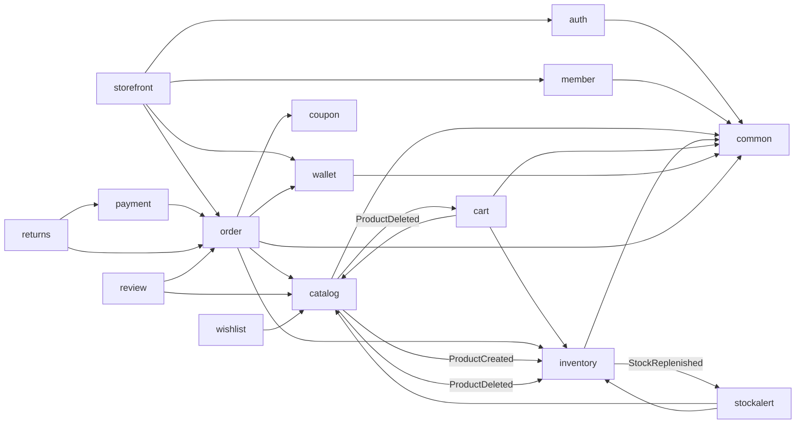
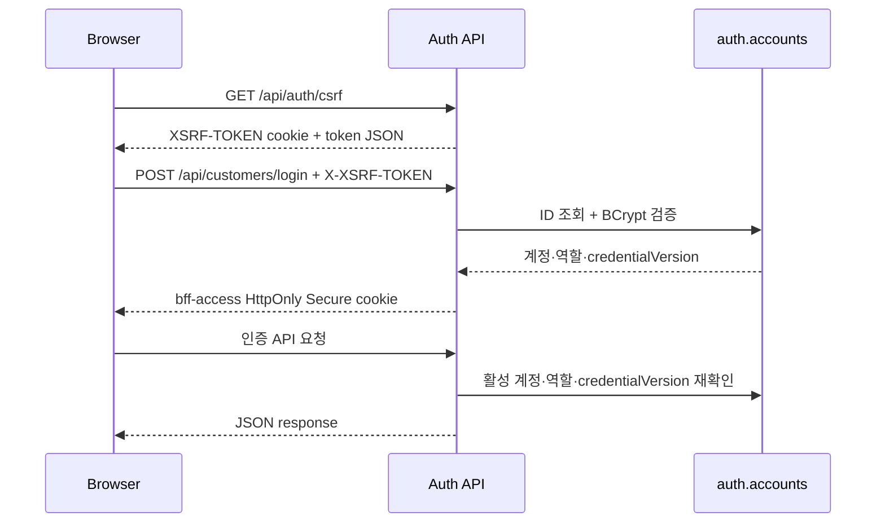
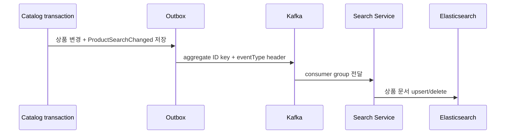
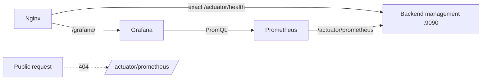

# 아키텍처와 모듈 경계

## 1. 모듈러 모놀리스와 Search Service

SKALA Shop의 핵심 도메인은 하나의 Spring Boot 프로세스와 PostgreSQL을 사용합니다.
주문 트랜잭션은 단순하게 유지하면서 코드와 데이터는 비즈니스 도메인별로
분리했습니다. 검색은 원자 트랜잭션에 덜 묶여 있으므로 별도 Spring Boot 프로세스와
Elasticsearch로 분리했습니다.

이 선택의 목표는 다음과 같습니다.

- 초기에는 한 애플리케이션으로 빠르게 개발·운영합니다.
- 주문·재고·포인트를 하나의 로컬 트랜잭션으로 안전하게 처리합니다.
- 모듈 간 직접 결합을 제한해 코드 규모가 커져도 책임을 찾기 쉽게 합니다.
- 모듈 간 호출은 공개 API와 이벤트를 통해 이루어집니다.
- 상품 검색 장애가 주문·결제 트랜잭션으로 전파되지 않게 합니다.

현재 구조는 “폴더만 나눈 모놀리스”가 아닙니다. Spring Modulith 테스트가 패키지
의존을 검사하고, 각 모듈이 자신의 테이블과 Repository를 소유합니다.

## 2. 코드 읽는 방법

모듈 하나는 대체로 다음 구조를 가집니다.

```text
com.skala.shopping.<module>
├── <Module>Api.java             # 다른 모듈이 사용할 공개 인터페이스
├── *View.java / *Command.java   # 공개 데이터 계약
├── package-info.java            # Spring Modulith 모듈 설명
└── internal/
    ├── *ApplicationService.java # 트랜잭션과 유스케이스
    ├── *Repository.java         # 이 모듈의 DB 접근
    ├── domain/                  # Entity와 도메인 규칙
    └── web/
        ├── *Controller.java     # HTTP 진입점
        └── dto/
            ├── request/         # 프론트 JSON을 받는 DTO
            └── response/        # 프론트에 반환하는 DTO
```

`internal`은 다른 모듈이 구현 세부사항에 의존하지 못하게 하는 경계입니다. 다른
모듈은 최상위 패키지의 공개 API, 이벤트와 View만 사용합니다.

## 3. 모듈별 책임

| 모듈 | 소유하는 책임 | 대표 공개 계약 |
| --- | --- | --- |
| `auth` | 계정, 비밀번호, JWT, Refresh Token, 역할, 인증 제한 | 인증 쿠키·계정 조회 API |
| `member` | 고객 프로필과 배송지 | `MemberApi` |
| `catalog` | 카테고리, 상품과 SKU 옵션 | `CatalogApi`, 상품 이벤트 |
| `inventory` | SKU별 주문 가능 재고와 원장 | `InventoryApi` |
| `cart` | 회원 장바구니 | 장바구니 HTTP API |
| `wallet` | 포인트 잔액과 거래 원장 | `WalletApi` |
| `order` | 주문·취소·배송 상태 | 주문 HTTP API와 View |
| `payment` | 포인트·Fake PG 결제와 환불 원장 | `PaymentApi` |
| `returns` | 배송 후 항목별 반품과 검수 | `ReturnApi` |
| `outbox` | 이벤트 영속화와 Kafka relay | Outbox recorder |
| `search` | 공개 검색 계약, Search Service 호출과 DB 폴백 | 검색 HTTP API |
| `coupon` | 쿠폰 규칙과 사용 이력 | `CouponApi` |
| `wishlist` | 회원별 관심 상품 | `WishlistApi` |
| `review` | 구매 인증 리뷰 | `ReviewApi` |
| `stockalert` | 재입고 구독과 알림 상태 | `StockAlertApi` |
| `storefront` | 고객 중심 호환 유스케이스 조합 | 회원가입·기존 URI |
| `common` | 공통 오류와 페이지 응답 | `ApiError`, `PageResponse` |

`storefront`는 여러 모듈의 결과를 조합하지만 테이블이나 핵심 도메인 규칙을
소유하지 않습니다.

## 4. 모듈 의존 방향



핵심 규칙:

- 다른 모듈의 Entity와 Repository를 직접 참조하지 않습니다.
- 모듈 간 JPA 연관관계나 SQL JOIN을 만들지 않습니다.
- 같은 모듈이 소유한 테이블끼리는 FK, JOIN과 JPA 매핑을 사용할 수 있습니다.
- 모듈 간 식별자는 UUID 값으로 전달하고 저장합니다.
- HTTP 요청·응답에 JPA Entity를 노출하지 않습니다.
- `common`에는 특정 도메인의 비즈니스 로직을 넣지 않습니다.

`ModularityTests`가 허용되지 않은 패키지 의존을 자동으로 검증합니다.

## 5. PostgreSQL 데이터 소유권

시각 자료는 [도메인 ERD](erd/skala-shopping-erd-overview.svg)와
[전체 테이블 ERD](erd/skala-shopping-erd-full.svg)를 참고합니다.

```text
auth
└── accounts

member
├── members
└── member_addresses

catalog
├── categories
├── products
└── product_variants

inventory
├── stocks
└── stock_movements

cart
├── carts
└── cart_items

wallet
├── point_accounts
└── point_transactions

orders
├── orders
├── order_items
├── order_cancellations
├── order_shipping_addresses
└── order_status_histories

payment
├── payments
├── payment_refunds
└── payment_webhook_events

returns
├── return_requests
└── return_status_commands

outbox
└── outbox_events

coupon
└── coupon_usages

wishlist
└── wishlist_items

reviews
└── product_reviews

stockalert
└── stock_alert_subscriptions
```

모든 모듈은 현재 같은 PostgreSQL 인스턴스를 사용하지만 테이블 소유자는 하나로
정합니다. `member_addresses → members`, `products → categories`처럼 같은 모듈
안에서는 물리 FK를 사용합니다. `orders.orders.member_id`,
`orders.order_items.product_id`처럼 모듈을 넘는 식별자에는 물리 FK를 두지
않습니다.

이 규칙 덕분에 서비스를 분리할 때 다른 모듈의 테이블을 함께 옮겨야 하는 상황을
줄일 수 있습니다.

## 6. 주요 요청 흐름

### 인증



Access Token은 브라우저 JavaScript에 반환하지 않고 HttpOnly 쿠키에 저장합니다.
비밀번호 변경 시 `credentialVersion`을 올려 기존 JWT를 무효화합니다. 운영 쿠키는
`Secure`, CSRF 쿠키는 JavaScript가 헤더로 되돌려 보내야 하므로 HttpOnly가 아닙니다.

### 다중 상품 주문과 결제

```text
요청 형식·중복 상품·수량 검증
→ SKU ID 순으로 정렬
→ 판매 상품·SKU 옵션과 주문 시점 이름·단가 조회
→ 포인트 사용액 차감
→ 멱등 재시도 여부 재확인
→ 정렬된 순서로 재고 잠금과 예약
→ 주문·항목·SKU·배송지 스냅샷 저장
→ Fake PG 금액이 있으면 PAYMENT_PENDING, 없으면 PAID
→ 결제 승인 후 PAID 또는 실패 시 PAYMENT_FAILED와 보상
→ 전체 commit 또는 전체 rollback
```

SKU ID 정렬은 동시 주문의 잠금 순서를 고정해 교착 가능성을 낮춥니다. 주문
fingerprint에는 회원, 정렬된 상품·SKU·수량, 배송지, 쿠폰과 포인트 사용액이
포함되며 SHA-256으로 저장됩니다. 같은 회원과 명령 키의 첫 요청은 PostgreSQL
트랜잭션 advisory lock으로 직렬화합니다. 같은 키와 같은 요청은 최초 결과를
반환하고, 같은 키에 다른 내용이 오면 `IDEMPOTENCY_CONFLICT`를 반환합니다.

### 취소·반품과 환급

취소는 주문 조회 결과의 `orderItemId`로 정확한 SKU와 수량을 지정합니다. 기존
`productId` 방식은 취소 가능한 SKU가 하나뿐인 단순 상품에 한해 호환 경로로
유지합니다. 주문과 해당 주문 항목을 잠근 뒤, 주문 당시 쿠폰 할인 후 항목별로
배분해 저장한 실제 결제액을 기준으로 포인트와 Fake PG 금액을 누적 결제 비율대로
나눠 환급합니다. 외부 결제 환불 이벤트는 동기 listener가 같은 트랜잭션에서
Payment 원장에 반영하고, 결정적인 하위 명령 ID로 재고를 복원합니다. 부분 취소의
소수점 절사 차이는 마지막 취소가 흡수하므로 항목별 누적 환불액이 결제액을 넘지
않습니다. 주문 상태, 취소 이력, 포인트·Fake PG 환급과 재고 복원 중 하나라도
실패하면 전체를 롤백합니다.

금전 상태 `PAID/PARTIALLY_CANCELED/CANCELED`와 배송 상태는 별도입니다. 배송은
`PAID → PREPARING → SHIPPED → DELIVERED` 순서만 허용합니다. 결제 대기·실패·전량
취소 주문에는 배송 상태나 운송장을 등록할 수 없고 `SHIPPED` 이후에는 취소할 수
없습니다.

배송 완료 뒤에는 주문 항목별 반품을 신청합니다. 반품은
`REQUESTED → COLLECTING → INSPECTING → APPROVED → REFUNDED` 또는 `REJECTED`로
전이합니다. 같은 항목의 여러 부분 반품은 활성 요청 수량 합계를 주문 항목 잠금
안에서 검사하며, 거절된 요청의 수량은 다시 신청할 수 있습니다. 상태 변경 명령은
요청 내용과 최초 응답 snapshot을 별도 기록해 재시도 시 정산을 반복하지 않습니다.
환불 완료 트랜잭션에서 포인트/Fake PG 환급과 판매 가능 재고 복원을 함께 처리합니다.

### 장바구니와 배송지

장바구니에는 가격을 복제하지 않고 조회 시 Catalog와 Inventory의 현재 정보를
조합합니다. 반대로 주문에는 이후 상품 가격이나 회원 배송지가 바뀌어도 과거
내역이 변하지 않도록 상품명·단가·배송지를 스냅샷으로 저장합니다.

저장 배송지는 회원당 최대 10개이며 PostgreSQL partial unique index로 기본
배송지를 회원당 하나만 허용합니다.

## 7. 일관성·동시성·멱등성

- 주문·취소·결제·반품·재고 조정 명령은 UUID `X-Idempotency-Key`를 사용합니다.
- 포인트와 재고의 수정 쿼리는 잠금과 조건을 사용해 음수 잔액·재고를 방지합니다.
- 다중 상품 재고는 동일한 정렬 순서로 잠급니다.
- 주문 상세는 `REPEATABLE_READ` snapshot으로 주문과 항목을 일관되게 읽습니다.
- 주문·취소·결제 승인·반품 상태 변경은 요청 fingerprint와 최초 결과 snapshot을
  보존해 이후 상태와 섞이지 않게 합니다.
- JPA 낙관적 잠금 충돌은 일반 500이 아니라 `409 CONCURRENT_MODIFICATION`으로
  반환합니다.
- 상품·회원·주문·원장 페이지는 동률에서 누락되지 않도록 `id` 보조 정렬을 둡니다.

목록 API는 안정적인 보조 정렬을 포함한 offset pagination을 사용합니다.

## 8. Outbox, Kafka와 검색

Catalog와 Inventory는 애플리케이션 내부 상태 변경 이벤트를 발행합니다.

- `ProductCreated`: 같은 트랜잭션에서 초기 재고 생성
- `ProductDeleted`: 상품 또는 SKU 재고 비활성화와 해당 장바구니 항목 정리
- `StockReplenished`: 재고가 0에서 양수로 바뀔 때 대기 중 구독을 알림 완료로 변경
- `ProductSearchChanged`: Elasticsearch 상품 색인 갱신

`OrderPlaced`, `ProductCreated`, `ProductSearchChanged`, `StockReplenished`는 원본 데이터 변경과 같은
트랜잭션에서 `outbox.outbox_events`에 저장됩니다. Relay는 `PENDING` 이벤트를
Kafka로 발행하고 성공 시 `PUBLISHED`, 반복 실패 시 `DEAD`로 기록합니다. 같은
aggregate ID를 Kafka key로 사용해 partition 안의 순서를 유지합니다. 로컬에서는
logging publisher를 사용할 수 있습니다.

Relay는 원본 JSON과 함께 `eventType` Kafka header를 발행합니다. Search Service는
`ProductSearchChanged`만 소비해 Elasticsearch를 갱신하고, 해석이나 색인에 실패한
record는 고정 간격으로 재시도한 뒤 `.DLT` 토픽에 보존합니다.



Backend의 `/api/search/products` 계약은 그대로 유지합니다. Backend는 사설 HTTP로
Search Service를 호출하고, 연결 실패나 시간 초과일 때 Catalog PostgreSQL 검색으로
폴백합니다. Search Service는 RDS에 직접 연결하지 않으며, 빈 인덱스 초기화와 관리자
재색인 때만 Backend의 공개 Catalog API를 페이지 단위로 읽습니다. 전체 재색인은 새
문서를 먼저 저장한 뒤 사라진 문서만 제거해 색인 공백을 피합니다.

Elasticsearch는 Search Service 전용 Docker network에만 있고 호스트 9200 포트를
열지 않습니다. Search Service의 8081 포트도 사설 IP와 Application 보안 그룹에만
허용합니다. 회원·주문·결제·재고와 알림·재입고 알림은 기존 모듈러 모놀리스에
유지합니다.

## 9. 운영 관측 구조

운영 profile은 사용자 API와 관리 트래픽을 같은 포트에 두지 않습니다. Backend는
8080에서 API를 제공하고, Actuator health와 Prometheus 메트릭은 Docker 내부
management 포트 9090에만 매핑합니다.



Prometheus와 Grafana는 Backend·Redis와 같은 애플리케이션 EC2의 Docker 내부
network에서 실행하며 호스트 port를 열지 않습니다. Nginx는 공개 health endpoint
하나만 management 포트로 전달하고 `/actuator/prometheus`를 포함한 나머지 Actuator
경로는 외부에서 404로 처리합니다. Grafana는 `/grafana/`로 접근하지만 자체 로그인이
필수이며 anonymous access와 사용자 가입은 비활성화합니다.

Micrometer 기본 meter를 사용해 HTTP 요청 수·상태·지연 시간, JVM·process·system과
HikariCP 상태를 수집합니다. `application=skala-shop-api` 공통 tag를 사용하고 사용자
ID나 주문 ID 같은 높은 cardinality 값은 label로 추가하지 않습니다. Prometheus는
데이터를 3일 또는 512MB까지 보존하고, Grafana에는 Backend overview dashboard와
Prometheus datasource를 provisioning합니다.

애플리케이션 상태는 다음 낮은 cardinality counter로도 구분합니다.

- `shopping_business_errors_total`: 공통 비즈니스 오류 code와 HTTP status
- `shopping_payment_results_total`: 결제 승인 결과와 실패 code
- `shopping_payment_refunds_total`: Fake PG 환불 결과
- `shopping_payment_reconciliations_total`: 결제 재처리 결과
- `shopping_payment_webhooks_total`: Fake PG webhook 처리 유형

배포와 rollback은 컨테이너가 단순히 실행 중인지만 보지 않습니다. Prometheus와
Grafana health가 정상이고 Prometheus API에서 `up{job="skala-shop-api"}=1`이 확인돼야
edge를 전환합니다. 현재 구성은 한 EC2의 local volume을 사용하는 단일 node이므로
모니터링 자체의 고가용성은 제공하지 않습니다. Alertmanager도 포함하지 않아 기존
CloudWatch 인프라 alarm과 별개로 Grafana 화면을 확인하는 구조입니다.

## 10. Flyway 변경 규칙

- 적용된 마이그레이션은 수정·삭제하지 않고 새 버전을 추가합니다.
- 새 마이그레이션은 가능하면 한 모듈의 테이블만 변경합니다.
- 운영 컬럼 삭제·이름 변경은 한 번에 하지 않고 expand/contract를 사용합니다.
- 애플리케이션 롤백이 DB 마이그레이션까지 되돌린다고 가정하지 않습니다.
- 파괴적 변경 전 RDS snapshot/backup과 forward-fix 절차를 준비합니다.

현재 최신 마이그레이션은 V26입니다. V25는 부분 반품과 반품 상태 명령 이력을,
V26은 결제 승인 요청 fingerprint와 최초 결과 snapshot을 추가합니다. V13은 초기
기능 확장에서 Member와 Cart를 함께 만든 과거 예외이며 이후 마이그레이션은 모듈
소유권을 유지합니다.
