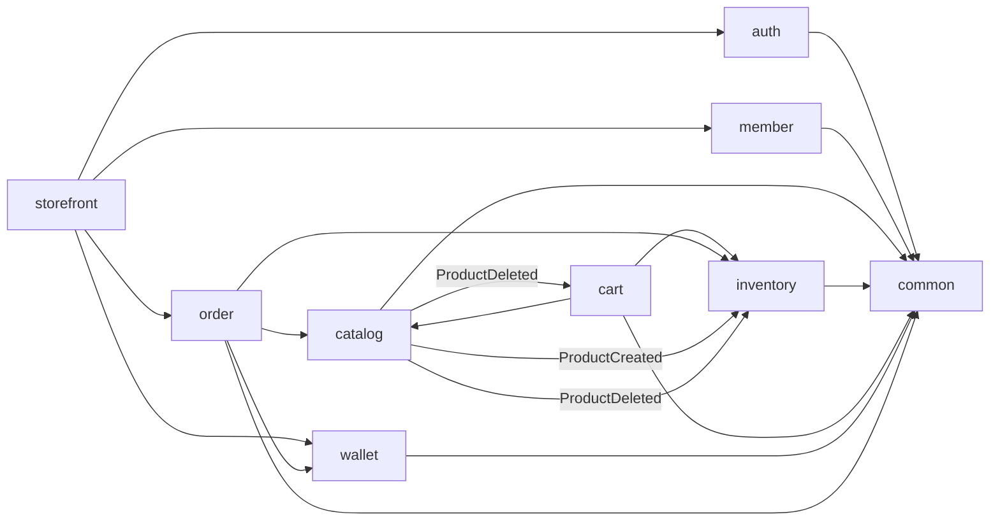
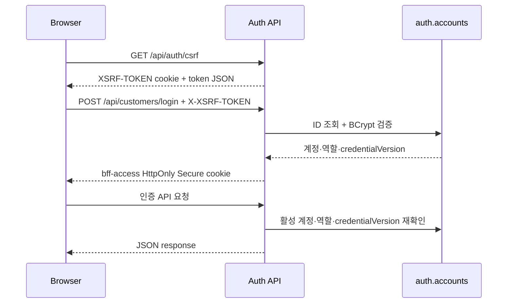

# 아키텍처와 모듈 경계

## 1. 왜 모듈러 모놀리식인가

SKALA Shop은 하나의 Spring Boot 프로세스와 PostgreSQL을 사용합니다. 배포와
트랜잭션은 단순하게 유지하면서 코드와 데이터는 비즈니스 도메인별로 분리했습니다.

이 선택의 목표는 다음과 같습니다.

- 초기에는 한 애플리케이션으로 빠르게 개발·운영합니다.
- 주문·재고·포인트를 하나의 로컬 트랜잭션으로 안전하게 처리합니다.
- 모듈 간 직접 결합을 제한해 코드 규모가 커져도 책임을 찾기 쉽게 합니다.
- 트래픽과 장애 격리가 실제로 필요해진 모듈만 나중에 서비스로 분리합니다.

현재 구조는 “폴더만 나눈 모놀리스”가 아닙니다. Spring Modulith 테스트가 패키지
의존을 검사하고, 각 모듈이 자신의 테이블과 Repository를 소유합니다.

## 2. 코드 읽는 방법

모듈 하나는 대체로 다음 구조를 가집니다.

```text
com.skala.shopping.<module>
├── <Module>Api.java             # 다른 모듈이 사용할 공개 인터페이스
├── *View.java / *Command.java   # 공개 데이터 계약
├── package-info.java            # Spring Modulith 모듈 설명
└── internal/
    ├── *ApplicationService.java # 트랜잭션과 유스케이스
    ├── *Repository.java         # 이 모듈의 DB 접근
    ├── domain/                  # Entity와 도메인 규칙
    └── web/
        ├── *Controller.java     # HTTP 진입점
        └── dto/
            ├── request/         # 프론트 JSON을 받는 DTO
            └── response/        # 프론트에 반환하는 DTO
```

`internal`은 다른 모듈이 구현 세부사항에 의존하지 못하게 하는 경계입니다. 다른
모듈은 최상위 패키지의 공개 API, 이벤트와 View만 사용합니다.

## 3. 모듈별 책임

| 모듈 | 소유하는 책임 | 대표 공개 계약 |
| --- | --- | --- |
| `auth` | 계정, 비밀번호, JWT, 역할, 인증 제한 | 인증 쿠키·계정 조회 API |
| `member` | 고객 프로필과 배송지 | `MemberApi` |
| `catalog` | 카테고리와 상품 | `CatalogApi`, 상품 이벤트 |
| `inventory` | 주문 가능 재고와 원장 | `InventoryApi` |
| `cart` | 회원 장바구니 | 장바구니 HTTP API |
| `wallet` | 포인트 잔액과 거래 원장 | `WalletApi` |
| `order` | 주문·취소·배송 상태 | 주문 HTTP API와 View |
| `storefront` | 고객 중심 호환 유스케이스 조합 | 회원가입·기존 URI |
| `common` | 공통 오류와 페이지 응답 | `ApiError`, `PageResponse` |

`storefront`는 여러 모듈의 결과를 조합하지만 테이블이나 핵심 도메인 규칙을
소유하지 않습니다.

## 4. 모듈 의존 방향



핵심 규칙:

- 다른 모듈의 Entity와 Repository를 직접 참조하지 않습니다.
- 모듈 간 JPA 연관관계나 SQL JOIN을 만들지 않습니다.
- 같은 모듈이 소유한 테이블끼리는 FK, JOIN과 JPA 매핑을 사용할 수 있습니다.
- 모듈 간 식별자는 UUID 값으로 전달하고 저장합니다.
- HTTP 요청·응답에 JPA Entity를 노출하지 않습니다.
- `common`에는 특정 도메인의 비즈니스 로직을 넣지 않습니다.

`ModularityTests`가 허용되지 않은 패키지 의존을 자동으로 검증합니다.

## 5. PostgreSQL 데이터 소유권

```text
auth
└── accounts

member
├── members
└── member_addresses

catalog
├── categories
└── products

inventory
├── stocks
└── stock_movements

cart
├── carts
└── cart_items

wallet
├── point_accounts
└── point_transactions

orders
├── orders
├── order_items
├── order_cancellations
├── order_shipping_addresses
└── order_status_histories
```

모든 모듈은 현재 같은 PostgreSQL 인스턴스를 사용하지만 테이블 소유자는 하나로
정합니다. `member_addresses → members`, `products → categories`처럼 같은 모듈
안에서는 물리 FK를 사용합니다. `orders.orders.member_id`,
`orders.order_items.product_id`처럼 모듈을 넘는 식별자에는 물리 FK를 두지
않습니다.

이 규칙 덕분에 서비스를 분리할 때 다른 모듈의 테이블을 함께 옮겨야 하는 상황을
줄일 수 있습니다.

## 6. 주요 요청 흐름

### 인증



Access Token은 브라우저 JavaScript에 반환하지 않고 HttpOnly 쿠키에 저장합니다.
비밀번호 변경 시 `credentialVersion`을 올려 기존 JWT를 무효화합니다. 운영 쿠키는
`Secure`, CSRF 쿠키는 JavaScript가 헤더로 되돌려 보내야 하므로 HttpOnly가 아닙니다.

### 다중 상품 주문

```text
요청 형식·중복 상품·수량 검증
→ 상품 ID 순으로 정렬
→ 판매 상품과 주문 시점 이름·단가 조회
→ 포인트 계정 잠금과 전체 금액 차감
→ 멱등 재시도 여부 재확인
→ 정렬된 순서로 재고 잠금과 예약
→ 주문·항목·배송지 스냅샷 저장
→ 초기 배송 이력 PAID 저장
→ 전체 commit 또는 전체 rollback
```

상품 ID 정렬은 동시 주문의 잠금 순서를 고정해 교착 가능성을 낮춥니다. 주문
fingerprint에는 회원, 정렬된 상품·수량과 배송지가 포함됩니다. 같은 키와 같은
요청은 최초 결과를 반환하고, 같은 키에 다른 내용이 오면
`IDEMPOTENCY_CONFLICT`를 반환합니다.

### 취소와 환급

취소 가능한 주문항목을 잠그고 최신 구매부터 요청 수량을 차감합니다. 주문 당시
단가로 포인트를 환급하고 같은 취소 ID로 재고를 복원합니다. 주문 상태, 취소 이력,
포인트 환급과 재고 복원 중 하나라도 실패하면 전체를 롤백합니다.

금전 상태 `PAID/PARTIALLY_CANCELED/CANCELED`와 배송 상태는 별도입니다. 배송은
`PAID → PREPARING → SHIPPED → DELIVERED` 순서만 허용하며 `SHIPPED` 이후에는
취소할 수 없습니다.

### 장바구니와 배송지

장바구니에는 가격을 복제하지 않고 조회 시 Catalog와 Inventory의 현재 정보를
조합합니다. 반대로 주문에는 이후 상품 가격이나 회원 배송지가 바뀌어도 과거
내역이 변하지 않도록 상품명·단가·배송지를 스냅샷으로 저장합니다.

저장 배송지는 회원당 최대 10개이며 PostgreSQL partial unique index로 기본
배송지를 회원당 하나만 허용합니다.

## 7. 일관성·동시성·멱등성

- 주문·취소·재고 조정 명령은 UUID `X-Idempotency-Key`를 사용합니다.
- 포인트와 재고의 수정 쿼리는 잠금과 조건을 사용해 음수 잔액·재고를 방지합니다.
- 다중 상품 재고는 동일한 정렬 순서로 잠급니다.
- 주문 상세는 `REPEATABLE_READ` snapshot으로 주문과 항목을 일관되게 읽습니다.
- 멱등 재생에는 최초 결과 스냅샷을 보존해 이후 상태와 섞이지 않게 합니다.
- 상품·회원·주문·원장 페이지는 동률에서 누락되지 않도록 `id` 보조 정렬을 둡니다.

현재 목록은 offset pagination입니다. 데이터가 커지면 주문과 원장부터
`(createdAt, id)` cursor/keyset pagination으로 바꿀 수 있습니다.

## 8. 이벤트 사용

Catalog는 상품 생성·삭제 이벤트를 발행합니다.

- `ProductCreated`: 같은 트랜잭션에서 초기 재고 생성
- `ProductDeleted`: 재고 비활성화와 해당 상품 장바구니 항목 정리

현재 이벤트는 같은 프로세스와 트랜잭션에서 처리됩니다. Catalog를 분리하면
Outbox를 통해 메시지로 발행하고 소비자 멱등성과 재처리를 추가해야 합니다.

## 9. MSA 전환 순서

### 1단계: Cart 또는 Catalog

Cart는 주문 원자 트랜잭션에 직접 참여하지 않아 가장 먼저 분리하기 좋습니다.
저장소를 옮기고 Catalog/Inventory 공개 조회를 HTTP 클라이언트로 바꿉니다.

Catalog를 분리할 때 `CatalogApi`의 로컬 구현을 원격 어댑터로 교체합니다. 주문에
상품명·단가 스냅샷이 있어 과거 주문 조회는 Catalog 장애에 의존하지 않습니다.

### 2단계: Auth와 Member

Auth를 별도 서비스로 옮기고 HMAC 공유 키를 비대칭 서명·JWKS 방식으로 바꿉니다.
Member를 옮겨도 Order가 소유한 배송지 스냅샷은 그대로 둡니다.

### 3단계: Wallet

Wallet부터 로컬 DB 트랜잭션을 사용할 수 없습니다. Outbox, 메시지 브로커, Saga,
보상 처리, 재시도, Dead Letter Queue와 분산 추적을 먼저 준비합니다.

### 4단계: Inventory

원격 재고 예약에는 주문 `PENDING`, 예약 만료와 포인트 실패 시 재고 해제 같은
보상 흐름이 필요합니다. 다중 상품 부분 성공도 복구할 수 있어야 합니다.

### 5단계: Order

Order는 전체 구매 흐름의 조정자이므로 마지막에 분리합니다. 서비스 이동보다
Saga 상태, Outbox relay, 재처리 운영 도구와 관측 가능성을 먼저 완성합니다.

## 10. Flyway 변경 규칙

- 적용된 마이그레이션은 수정·삭제하지 않고 새 버전을 추가합니다.
- 새 마이그레이션은 가능하면 한 모듈의 테이블만 변경합니다.
- 운영 컬럼 삭제·이름 변경은 한 번에 하지 않고 expand/contract를 사용합니다.
- 애플리케이션 롤백이 DB 마이그레이션까지 되돌린다고 가정하지 않습니다.
- 파괴적 변경 전 RDS snapshot/backup과 forward-fix 절차를 준비합니다.

V13은 초기 기능 확장에서 Member와 Cart를 함께 만든 과거 예외입니다. 이후
마이그레이션은 모듈 소유권을 유지합니다.
